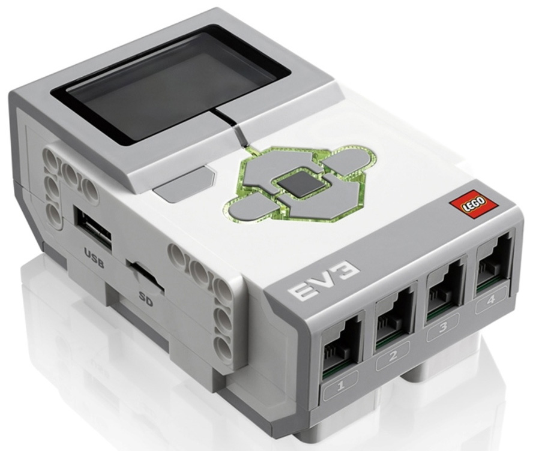

# About LEGO EV3


This article is automatically translated from Russian by Google Translator.


**Lego EV3** is an educational robotics platform. TRIK Studio supports this programming platform.


For more information, see the manufacturer's [official website](https://education.lego.com).


## Programming LEGO EV3

To program a Lego EV3 controller, select "Lego EV3" in the TRIK Studio settings in the "[Robots](../studio/interface/faq-robot-settings.md)" tab.

Use [specialized](blocks.md) and [general](../studio/programming-visual/blocks.md) blocks for writing programs. Read more about visual programming in the article


[programming-visual](../studio/programming-visual/)

