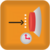

# LEGO EV3 specific blocks


This article is automatically translated from Russian by Google Translator.


Specialized blocks for LEGO EV3 are divided into several categories:

1. [Action](blocks.md#action-blocks) — blocks that perform some action on the robot: turn on motors, play sound, etc.
2. [Waiting](blocks.md#waiting-blocks) — units waiting for some event to occur: certain sensor readings, button presses, etc.
3. [Drawings on the display](blocks.md#drawing-on-the-display) — blocks used to display graphics and text on the screen
4. [Line Leader](blocks.md#line-leader) — blocks for the advanced "Line Leader" sensor.

&#x20;For the blocks available for all platforms, see the article "[Common Blocks](../studio/programming-visual/blocks.md)".

## Action blocks

| Icon                                                                                         | Name                                                             | Description                                                                                                                                          |
| -------------------------------------------------------------------------------------------- | ---------------------------------------------------------------- | ---------------------------------------------------------------------------------------------------------------------------------------------------- |
|        | [Send Message to Thread](blocks.md#send-message-to-thread)       | Sends this message to the parallel task with the specified identifier (the identifier must be specified when creating the task in the "Fork" block). |
|                      | [Beep](blocks.md#beep)                                           | Play a fixed-frequency sound on the robot.                                                                                                           |
|                  | [Play Tone](blocks.md#play-tone)                                 | Play the sound on the robot at a given frequency and duration.                                                                                       |
|            | [Motors Forward](blocks.md#motors-forward)                       | Turn on the motors on the set ports with the set power.                                                                                              |
|           | [Motors Backward](blocks.md#motors-backward)                     | Turn on the motors in reversing mode on the set ports with the set power.                                                                            |
|               | [Stop Motors](blocks.md#stop-motors)                             | Turn off the motors on the specified ports.                                                                                                          |
|      | [Clear Encoder](blocks.md#clear-encoder)                         | Reset the number of motor revolutions.                                                                                                               |
|                       | [LED](blocks.md#led)                                             | Set the color of the LED on the front of the robot.                                                                                                  |
|               | [Send Mail](blocks.md#send-mail)                                 | Send an email to another robot.                                                                                                                      |
|        | [Calibrate Gyroscope](blocks.md#calibrate-gyroscope)             | Sets the gyroscope to 0 at the current position.                                                                                                     |
|   | [Start Compass Calibration](blocks.md#start-compass-calibration) | Starts the compass calibration programmatically.                                                                                                     |
|    | [Stop Compass Calibration](blocks.md#stop-compass-calibration)   | Finishes the compass calibration.                                                                                                                    |
|                   | [Read RGB into Variables](blocks.md#read-rgb-into-variables)     | Read RGB in a variable.                                                                                                                              |

### Send Message to Thread

.png>)

Sends this message to the parallel task with the specified identifier (the identifier must be specified when creating the task in the "Fork" block).

The message can be any expression.

### Beep

.png>)

Play a fixed-frequency sound on the robot.

Parameters:

1. Whether to wait for the sound to end or go straight to the next block. Valid values are "true", "false".
2. Playback volume.

### Play Tone

.png>)

Play the sound on the robot at a given frequency and duration. Аналогичен блоку «[Гудок](blocks.md#gudok)», но позволяет также задавать параметры звука.

Parameters:

* Frequency (Hz).
* Duration (ms).
* Whether to wait for the sound to end or go to the next block immediately. Valid values - true, false.
* Playback volume (from 0 to 100%).

### **Motors Forward**

.png>)

Turn on the motors on the set ports with the set power. The ports are set by the letters A, B, or C, separated by commas.

The power is set as a percentage by a number from -100 to 100, if a negative value is set, the motor turns on in reverse mode.

The motors have different modes of operation: braking mode and sliding mode (indicated by a red or green rectangle on the block, respectively). The modes affect the way the motor responds to a command - braking mode stops the motor when shut down, the sliding mode allows the motor to crank through its inertia.

### **Motors Backward**

.png>)

Turn on the motors in reversing mode on the set ports with the set power. The parameters are the same as for the "Motors Forward" block.

### **Stop Motors**

.png>)

Turn off the motors on the specified ports.

### **Clear Encoder**

.png>)

Reset the number of motor revolutions.

### **LED**

.png>)

Set the color of the LED on the front of the robot.

### **Send Mail**

.png>)

Send an email to another robot. If the recipient's name is not filled in, the message will be sent to all connected robots.

### Calibrate Gyroscope

.png>)

Sets the gyroscope to 0 at the current position.

### Start Compass Calibration

.png>)

Starts the compass calibration programmatically.\
\
To calibrate the compass, the robot must turn in place more than 540° in one direction and then in the opposite direction. After the turns, the "Stop Compass Calibration" block must be added.

### Stop Compass Calibration

.png>)

Finishes the compass calibration. The calibration result is returned in a variable. A nonzero result means a successful calibration.

### Read RGB into Variables

.png>)

Read RGB in a variable.

## Waiting Blocks

| Icon                                                                                       | Name                                                                 | Description                                                                                                                               |
| ------------------------------------------------------------------------------------------ | -------------------------------------------------------------------- | ----------------------------------------------------------------------------------------------------------------------------------------- |
|   | [Receive Message from Thread](blocks.md#receive-message-from-thread) | Wait to receive a message from another parallel task.                                                                                     |
|      | [Wait for Touch Sensor](blocks.md#wait-for-touch-sensor)             | Wait until the touch sensor is triggered.                                                                                                 |
|          | [Wait for Encoder](blocks.md#wait-for-encoder)                       | Wait until the RPM counter reading on the specified motor reaches the RPM Limit value specified in the "RPM Limit" parameter value.       |
|            | [Wait for Color](blocks.md#wait-for-color)                           | Wait for the color sensor in color recognition mode to return the specified color.                                                        |
|   | [Wait for Color Intensity](blocks.md#wait-for-color-intensity)       | Wait until the value returned by the color sensor on the specified port is comparable to the value specified in the Intensity parameter.  |
|            | [Wait for Light](blocks.md#wait-for-light)                           | Wait until the value returned by the light sensor on the specified port is comparable to the value specified in the Percentage parameter. |
|    | [Wait for Range Sensor](blocks.md#wait-for-range-sensor)             | Wait until the distance returned by the ultrasonic distance sensor is comparable to that specified in the Distance parameter value.       |
|          | [Wait for Button](blocks.md#wait-for-button)                         | Wait for the button on the robot body to be pressed.                                                                                      |
|      | [Wait for Sound Sensor](blocks.md#wait-for-sound-sensor)             | Wait until the volume read by the microphone on the specified port is above or below the set value.                                       |
|        | [Wait for Gyroscope](blocks.md#wait-for-gyroscope)                   | Wait until the value returned by the gyroscope on the specified port is comparable to the value specified in the "Value" parameter.       |
|          | [Wait for Mail Receiving](blocks.md#wait-for-mail-receiving)         | Saves a message from another robot to a given variable.                                                                                   |

### Receive Message from Thread

.png>)

Wait to receive a message from another parallel task.

When a message is received, it will be assigned to the variable specified in the block.

The "Wait for message" property allows you to specify what to do if the message queue is empty: wait for a new message to arrive or continue working by assigning an empty string to the variable.

The message is automatically converted to the same type as the receiver variable. For example, if you send a number as a string, it will be accepted as a number.

### Wait for Touch Sensor

.png>)

Wait until the touch sensor is triggered.

The parameter specifies the number of the port to which the sensor is connected. Valid values: 1, 2, 3, 4.

### Wait for Encoder

.png>)

Wait until the RPM counter reading on the specified motor reaches the RPM Limit value specified in the "RPM Limit" parameter value.

Parameters:

1. Port - the name of the port to which the motor is connected (A, B, or C).
2. Read value - the operation that will be used for comparison with the entered RPM limit.
3. RPM limit.

### Wait for Color

.png>)

Wait for the color sensor in color recognition mode to return the specified color.

Parameters:

1. Color.
2. Port - the number of the port to which the color sensor is connected.

### Wait for Color Intensity

.png>)

Wait until the value returned by the color sensor on the specified port is comparable to the value specified in the Intensity parameter.

Parameters:

1. Intensity (0 to 100%).&#x20;
2. Port - number of the port to which the color sensor is connected.
3. Read value - the operation that will be used to compare with the entered intensity.

### Wait for Light

.png>)

Wait until the value returned by the light sensor on the specified port is comparable to the value specified in the Percentage parameter.

Parameters:

1. Percentages (from 0 to 100%).
2. Port - the number of the port to which the color sensor is connected.
3. Read value - the operation that will be used to compare with the Percent value.

### Wait for Range Sensor

.png>)

Wait until the distance returned by the ultrasonic distance sensor is comparable to that specified in the Distance parameter value.

Parameters:

1. Distance (in centimeters, from 0 to 255).
2. Port - number of the port to which the distance sensor is connected.
3. Read value - the operation that will be used for comparison with the entered distance.

### Wait for Button

.png>)

Wait for the button on the robot body to be pressed.

### Wait for Sound Sensor

.png>)

Wait until the volume read by the microphone on the specified port is above or below the set value.

### Wait for Gyroscope

.png>)

Wait until the value returned by the gyroscope on the specified port is comparable to the value specified in the "Value" parameter.

### Wait for Mail Receiving

.png>)

Saves a message from another robot to a given variable. If there is no message, the robot waits for the message to arrive if the flag is set. Otherwise, the variable is set to the default value.

## Drawing on the display

| Icon                                                                             | Name                                       | Description                                                                |
| -------------------------------------------------------------------------------- | ------------------------------------------ | -------------------------------------------------------------------------- |
|     | [Print Text](blocks.md#print-text)         | Prints the specified line at the specified location on the robot's screen. |
|   | [Clear Screen](blocks.md#clear-screen)     | Erase everything that is drawn on the screen.                              |
|      | [Draw Rectangle](blocks.md#draw-ractangle) | Draw a rectangle on the screen.                                            |
|     | [Draw Pixel](blocks.md#draw-pixel)         | Draw a point on the screen at the specified coordinates.                   |
|      | [Draw Line](blocks.md#draw-line)           | Draw a segment on the screen.                                              |
|    | [Draw Circle](blocks.md#draw-circle)       | Draw a circle on the screen with a given center and a given radius.        |

### Print Text

.png>)

Prints the specified line at the specified location on the robot's screen.

The default value of the Text property is treated as a pure string, and it will be displayed that way. To make the system assume that this is a textual expression (which can be useful, for example, when debugging variable values), check the "Calculate" checkbox in the Property Editor.

### Clear Screen

.png>)

Erase everything that is drawn on the screen.

### Draw Rectangle

.png>)

Draw a rectangle on the screen.

Parameters:

1. &#x20;X, Y - coordinates of the upper left corner.
2. The width of the rectangle.
3. The height of the rectangle.
4. Update the picture (true or false).

### Draw Pixel

.png>)

Draw a point on the screen at the specified coordinates.

### Draw Line

.png>)

Draw a segment on the screen.

Parameters:

1. X1, Y1 - coordinates of the beginning of the segment.
2. X2, Y2 - coordinates of the end of the segment.
3. Update the picture (true or false).

### Draw Circle

.png>)

Draw a circle on the screen with a given center and a given radius.

Parameters:

1. X, Y - coordinates of the center of the circle.
2. The radius of the circle.
3. Update the picture (true or false).

## Line Leader

| Icon                                                                                   | Name                                                             | Description                                                                                               |
| -------------------------------------------------------------------------------------- | ---------------------------------------------------------------- | --------------------------------------------------------------------------------------------------------- |
|       | [Calibrate White](blocks.md#calibrate-white)                     | Calibrates the white threshold for the sensor.                                                            |
|       | [Calibrate Black](blocks.md#calibrate-black)                     | Calibrates the black threshold for the sensor.                                                            |
|         | [Calibrate PID](blocks.md#calibrate-pid)                         | Sets the sensor setpoint (middle of the sensor above the line), P/(P factor), I/(I factor), D/(D factor). |
|          | [Sleep Line Leader](blocks.md#sleep-line-leader)                 | Sets the line sensor to power save mode.                                                                  |
|         | [Wake Up Line Leader](blocks.md#wake-up-line-leader)             | Includes a line sensor for operation.                                                                     |
|        | [Read Average to Variable](blocks.md#read-average-to-variable)   | Reads the weighted average value into a variable.                                                         |
|        | [Read Sensor to Array](blocks.md#read-sensor-to-array)           | Read values from the sensor (eight values).                                                               |
|   | [Read Steering to Variable](blocks.md#read-steering-to-variable) | Reads the control value into a variable.                                                                  |

### Calibrate White

.png>)

Calibrates the white threshold for the sensor. Must be on white.

### Calibrate Black

.png>)

Calibrates the black threshold for the sensor. Should be on black.

### Calibrate PID

.png>)

Sets the sensor setpoint (middle of the sensor above the line), P/(P factor), I/(I factor), D/(D factor).

### Sleep Line Leader

.png>)

Sets the line sensor to power save mode.

### Wake Up Line Leader

.png>)

Includes a line sensor for operation.

### Read Average to Variable

.png>)

Reads the weighted average value into a variable.

The value is calculated within the sensor, where each of the eight sensors is taken with a factor, and the average is calculated.

A value between 0 and 80 is expected (-1 is an error).

### Read Sensor to Array

.png>)

Read values from the sensor (eight values). Values from 0 to 100. 0 is black, 100 is white.

### Read Steering to Variable

.png>)

Reads the control value into a variable. The value is calculated inside the sensor and can be used immediately for motors.

A value from -100 to 100 is expected (-101 is an error).
