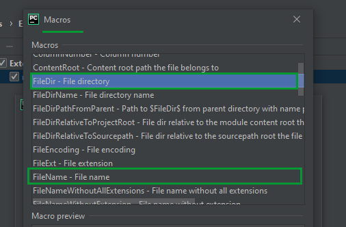

# Running a 2D model in TRIK Studio from PyCharm


This article is automatically translated from Russian by Google Translator.


This article deals with setting up and using the external programming environment **PyCharm** to call programs in the [2D model ](../../studio/2d-model/)of TRIK Studio.

This will allow experienced TRIK Studio users to use all the features of professional text editors and their plugins: static analyzers, auto formatters, color themes.

It also tells how to automatically run the program on several fields, which can be useful for participants of competitions with automated checking systems.

## **Preparation**

It is assumed that the user is writing a program in an external editor and would like to run this program on one or more fields. Fields can be presented both in the `.xml` format (more details in the article "[2D model tuning](../../studio/2d-model/settings.md)"), and in the`.qrs` format.

1. Download [run\_2d\_model.cmd](https://gist.github.com/anastasiia-kornilova/2b955e62c3cef7a509fc043a189ea3ff) file for Windows or **** [run\_2d\_model.sh](https://gist.github.com/anastasiia-kornilova/f13a708562debabeeb126381f3d535e5) for Linux and place it in the folder where TRIK Studio is installed.
2. Place the fields on which you want to test the program in a separate folder. If the fields are in `.xml` format, create an empty `default.qrs` project in this folder.

## Setting up PyCharm


Instructions tested on PyCharm Professional Edition (2019.3). \
You can download PyCharm from the [official website](https://www.jetbrains.com/ru-ru/pycharm/).


1\. Open the source code folder in **PyCharm** with `File → Open`.

2\. Choose`File → Settings` or press the key combination `«Ctrl+Alt+S»`.

3\. Choose`Tools → External tools` and click on the `«+»`.

4\.  In the `Name` field, enter the desired name of the tool, for example, `«run_2d_model»`. In the `Program` field, type your path to the file `run_2d_model.cmd`. In the `Arguments` type the parameters `$FileDir$` and `$FileName$` or choose`Insert Macros` and select the desired parameters from the list. In the `Working Directory` type`$FileDir$` or choose`Insert Macros` and select the desired parameter. Click the `OK` button.

5\. To run the code, select `Tools→ External tools` and `run_2d_model` (or its name, chosen earlier).

6\. To add "hotkeys" select `File → Settings` or press the key combination `«Ctrl+Alt+S»`. In the menu that appears, select the tab `Keymap` and go to the created `external tool`. Click on `run_2d_model` right mouse button, select `Add Keyboard Shortcut`.

7\. In the window that opens, enter the desired key combination to call the Toolbox and click `«ОК»`.

8\. Now you just have to press the selected combination (in this case `Shift+B`, but it is possible to choose any other) to run the code.


If an error occurs, select `Settings → Tools → Terminal` and enter your path to the cmd.exe file (`shell path`). Then click `Apply`.


