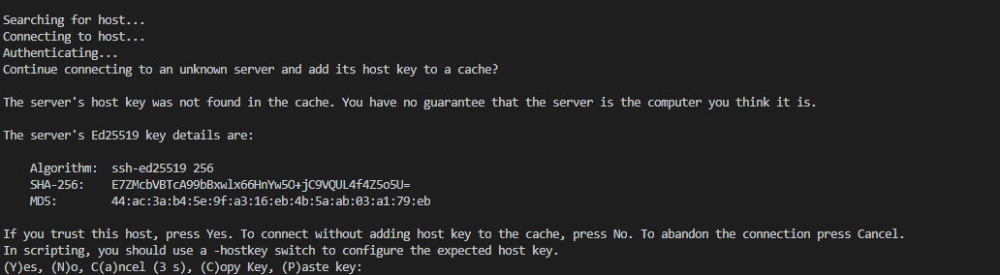
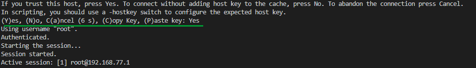

# Uploading programs to several TRIK robots from VSCode

This article discusses the possibility of simultaneous uploading of programs on a group of robots using an external text editor VSCode. The article is a continuation of the next material


[run-2d-from-vscode.md](run-2d-from-vscode.md)


## Setting up

Download the [send\_files.cmd](https://gist.github.com/anastasiia-kornilova/e1344f658a91449cf16217ec03147a18) file for Windows and place it in the folder where TRIK Studio is installed.


The manual was tested on the January 2020 release (version 1.42). You can download VSCode from the [official website](https://code.visualstudio.com/Download).


The first time the program is launched, confirmation from the user is required to establish a connection with the robot.



To allow the connection, enter `Y` or `Yes` at the command line.



1\. Open the folder with the files you want to send in VSCode using `File → Open Folder`.

2\. Select`Terminal → Configure Tasks`.


3\. If there were no tasks before, then select `Create tasks.json file from template → Others` from the drop-down menu. The `tasks.json` file will be opened. If tasks were created earlier, it will be opened right after step 2.


4\. Remove everything from this file and paste this code:

```javascript
{
    "version": "2.0.0",
        "tasks": [ {
            "label": "Send files",
            "type": "shell",
            "windows": {
                "command": "C:\\TRIKStudio\\send_files.cmd  <path to scripts dir> <file with ip addresses>"
            },
            "group": "test",
            "presentation": {
                "reveal": "always",
                "panel": "new"
            }
        }]
}
```

Where:

* `<path to scripts dir>` is the full path to the folder with programs that must be uploaded on robots,
* `<file with ip addresses>` is the name of the `.txt` file that contains the ip-addresses of robots for downloading files. One ip-address per line.

5\. In the line corresponding to the `"windows": {"command"` field specify the path to the `send_files.cmd` file. The file with the IP addresses of the robots must be in the same folder as the programs to be sent. For example:

```javascript
"command": "C:\TRIKStudio\send_files.cmd C:\Users\Admin\myfiles ip_addr.txt"
```


6\. Save the file `tasks.json`.

7\. Now select `Send files`in the dropdown menu `Terminal → Run Task`or press the corresponding keyboard shortcut (**Ctrl+Shift+B**) to upload programs to the robots.
