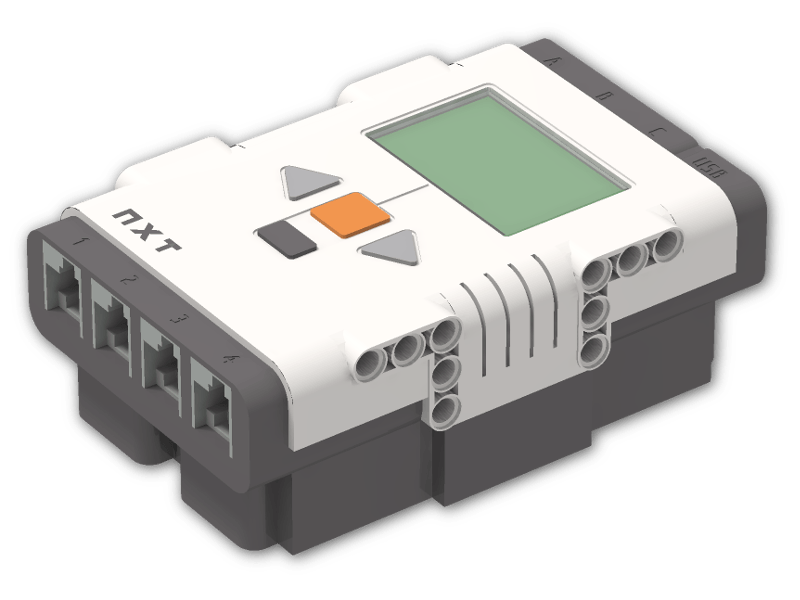

# About LEGO NXT


This article is automatically translated from Russian by Google Translator.


**Lego NXT** is an educational robotics platform. TRIK Studio supports this programming platform.


For more information, see the manufacturer's [official website](https://www.lego.com/en-us).


## LEGO NXT programming

To program a Lego NXT controller, select "Lego NXT" in the TRIK Studio settings in the "Robots" tab.

Use [specialized](blocks.md) and [common](../studio/programming-visual/blocks.md) blocks for writing programs.

Read more about visual programming in the article


[programming-visual](../studio/programming-visual/)

