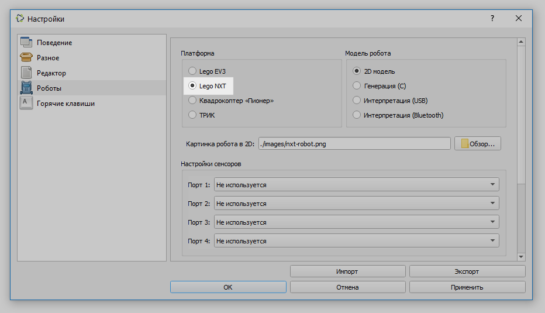
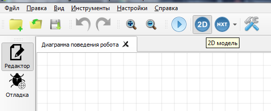
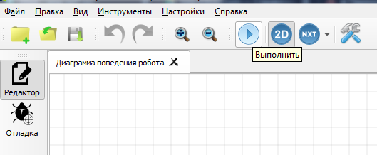
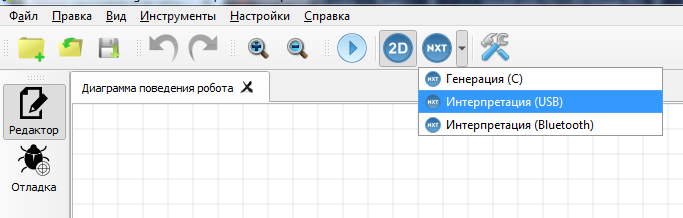
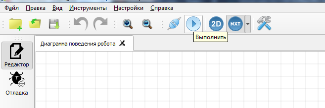

# Запуск программ и их загрузка на контроллер LEGO NXT

Для работы с контроллером LEGO NXT в настройках TRIK Studio перейдите в [раздел «Роботы»](../studio/settings.md#robots) и выберите платформу LEGO NXT.



Существует несколько вариантов выполнения программ для контроллера LEGO NXT:

* [Пошаговая интерпретация диаграммы с моделированием поведения робота на двумерной модели.](run-upload-programs.md#2d)
* [Пошаговая интерпретация диаграммы с посылкой команд в робота по Bluetooth или USB](run-upload-programs.md#interpretaciya-s-posylkoi-komand-v-robota-po-bluetooth-ili-usb).
* [Загрузка программы на робот и дальнейшее её автономное исполнение без связи с компьютером.](run-upload-programs.md#zagruzka-na-kontroller)

## **Интерпретация с моделированием поведения робота** <a href="#2d" id="2d"></a>


В режиме двумерной модели робота команды не передаются роботу, а исполняются пошагово для виртуальной модели, отображающейся на экране. Подробнее см. в статье [«2D-модель»](../studio/2d-model/).


&#x20;1\. Включите режим двумерной модели.



2\. Нажмите на кнопку «Выполнить».



3\. Откроется окно двумерной модели и начнется выполнение программы.


4\. При переключении в режим редактирования можно отслеживать шаги выполнения программы.


## **Интерпретация** с посылкой команд в робота по Bluetooth или USB

1\. Включите режим «Интерпретация (USB)» или «Интерпретация (Bluetooth).



2\. Нажмите на кнопку «Выполнить».



Если вы хотите использовать режим «Генерация» на Linux, то:

1. Откройте терминал (его можно открыть комбинацией Ctrl+Alt+T) и напишите: 
```
sudo addgroup legonxt
sudo adduser $USER legonxt
```
2. Создайте файл с именем 45-legonxt.rules
3. Заполните его содержимым: 
```
SUBSYSTEM=="usb", ATTRS{idVendor}=="0694", ATTRS{idProduct}=="0002", SYMLINK+="legonxt-%k", GROUP="legonxt", MODE="0666"

SUBSYSTEM=="usb", ATTRS{idVendor}=="03eb", ATTRS{idProduct}=="6124", SYMLINK+="legonxt-%k", GROUP="legonxt", MODE="0666"
```

4. Напишите из терминала (его можно открыть комбинацией Ctrl+Alt+T)
    
```sudo cp 45-legonxt.rules /etc/udev/rules.d```

   После перезагрузки Ваше устройство будет распознавать контроллер.


5. Вам понадобится arm-none-eabi. Его можно установить по [ссылке](https://developer.arm.com/-/media/Files/downloads/gnu/12.3.rel1/binrel/arm-gnu-toolchain-12.3.rel1-x86_64-aarch64-none-elf.tar.xz?rev=a8bbb76353aa44a69ce6b11fd560142d&hash=8DC6C55310058C1594FD6EEFD60F0B2528265C64). Затем необходимо разархивировать.

Так же вы можете запустить установочный скрипт download-arm-none-eabi.sh через консоль, он находится в папке TRIKStudio/bin/nxt-tools

Чтобы его запустить, достаточно написать в консоль из папки со скриптом
```chmod +x download-arm-eabi.sh
./download-arm-eabi.sh
```
Чтобы получить более подробную инструкцию по запуску скрипта, напишите
```
./download-arm-eabi.sh --help
```

6. Зайдите в Настройки. Укажите путь к папке, полученной после разархивации, а затем нажмите "Применить".

## **Загрузка на контроллер**

Из TRIK Studio можно загрузить готовую программу на робота, чтобы в дальнейшем автономно её исполнять без связи с компьютером.


Раздел дополняется.

