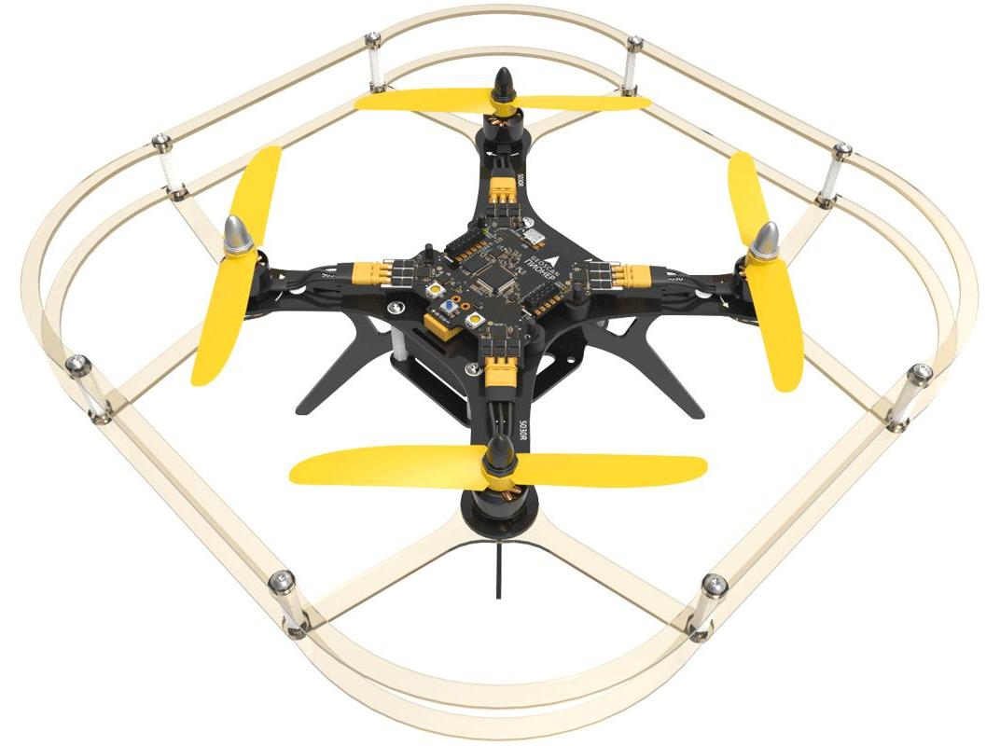

# About quadcopter Geoscan Pioneer


This article is automatically translated from Russian by Google Translator.


**Geoscan Pioneer Quadcopter** is a multifunctional training and teaching complex. TRIK Studio supports this programming platform.


For more information, see the manufacturer's [official website](https://www.geoscan.aero/en/products/pioneer/copter).


## Programming the quadcopter

To program the Geoscan Pioneer quadcopter, select "Pioneer Quadcopter" in the TRIK Studio settings under the "Robots" tab.

Use [specialized](blocks.md) and [common](../studio/programming-visual/blocks.md) blocks for writing programs.

Read more about visual programming in the article


[programming-visual](../studio/programming-visual/)

