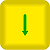
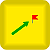

# Geoscan Pioneer specific blocks


This article is automatically translated from Russian by Google Translator.


For units available for all platforms, see the article


[blocks.md](../studio/programming-visual/blocks.md)


## Geoscan Pioneer quadcopter units

|                                           Icon                                          |        Name        | Description                                                                                                                                                                                |
| :-------------------------------------------------------------------------------------: | :----------------: | ------------------------------------------------------------------------------------------------------------------------------------------------------------------------------------------ |
|             |       Takeoff      | The command to start the flight.                                                                                                                                                           |
|             |       Landing      | End-of-flight command.                                                                                                                                                                     |
|       |  Go to local point | Specifies the destination point in local coordinates. The origin (0,0,0) is the takeoff point. The coordinate values are set in meters.                                                    |
|   |  Get LPS Position  | Returns the current position in the local coordinate system.                                                                                                                               |
|            |         LED        | Sets the color of the LED on the quadcopter.                                                                                                                                               |
|    |        Magnet      | Controls the operation of the load gripper [module](https://pioneer-doc.readthedocs.io/en/master/module/cargo.html). To enable the magnet, check the checkbox of the block property value. |
|           |       System       | Allows you to execute a command in [Lua](https://pioneer-doc.readthedocs.io/ru/master/programming/lua/lua\_main.html). To execute the command, check the checkbox.                         |
|       |         Yaw        | Controls the rotation around the vertical axis. To rotate clockwise, set the angle value in degrees with a minus sign.                                                                     |
|       | Read Range Sensor  | Reads the information from the rangefinder.                                                                                                                                                |
