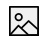
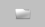
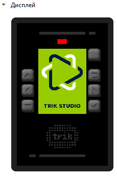

# 2D model

Interactive simulation mode is a distinctive feature of TRIK Studio. In that mode, the commands are executed for the virtual robot model displayed on the screen. For [TRIK](../../trik/about/), [Lego EV3](../../ev3/about.md) and [Lego NXT](../../nxt/about.md) kits the model is a three-wheeled cart.

Initially, the robot is in an infinite empty space, and the user has the opportunity to set different scene objects like walls, draw colored lines and areas on the floor.

At the same time, the work of the majority of the real robot sensors is emulated. For example, touch sensor, ultrasonic distance sensor, color and light sensors for NXT, compass, and gyroscope for EV3, infrared and ultrasonic distance sensors, touch sensor and light sensor for TRIK, and many others.

A two-dimensional model may have devices that are not available on a real robot. For example, the ability to draw colored lines with a marker on the floor. The appearance and set of devices of the two-dimensional model depend on the chosen platform.

The two-dimensional model mode is useful for debugging programs in the absence of a real robot.

## 2D model window 

To open the 2D model window, press the button  on the toolbar or choose in [settings](../settings.md#robots) "2D model".

2D model elements:

* [Tools for editing world model](./#editor-world)
* [Grid](./#grid)
* [Ruler](./#ruler)
* ["Return to start" button](./#return-to-start)
* ["Start/Stop" button](./#start-stop)
* [Panel for interpretation speed control](./#speed-control)
* [Model settings](./#panel-nastroiki-modeli)
  * [Display emulator and buttons of the robot](./#emulyator-ekrana)
  * [Ports control](./#ports)
  * [Motors control](./#panel-upravleniya-motorami)
  * [Robot physics settings](./#upravlenie-fizikoi-robota)
  * [Model parameters](./#parametry-modeli)
* [Robot popup menu](./#fast-settings)

## **Tools for editing world model** 

Editing the model of the world is carried out using the corresponding panel.

|                                                                                                                                                         | Name                              | Description                                                                                                                                                                                                                                                                                                                                                                                                                         | Shortcut |
| ------------------------------------------------------------------------------------------------------------------------------------------------------- | --------------------------------- | ----------------------------------------------------------------------------------------------------------------------------------------------------------------------------------------------------------------------------------------------------------------------------------------------------------------------------------------------------------------------------------------------------------------------------------- | :------: |
|  | **Cursor**                        | Switch to selection mode.                                                                                                                                                                                                                                                                                                                                                                                                           |     1    |
|               | **Wall**                          | 
Add a wall to the scene.

When added with the <code>Shift</code> key pressed, the wall is placed either at a right angle or at an angle of 45 ° relative to the borders of the window. The wall is displayed in the form of a "brick" line.  When such a line is touched by a touch sensor or when it enters the range of a distance sensor, the sensor is triggered. A robot cannot drive through a wall.
 |     2    |
|                   | **Can**                           | Add a can to the scene.                                                                                                                                                                                                                                                                                                                                                                                                             |     3    |
| 

                                                             | **Ball**                          | Add a ball to the scene. When the robot touches it, the ball bounces some distance.                                                                                                                                                                                                                                                                                                                                                 |     4    |
|              | **Line**                          | 
Add a straight line to the scene.

When added with the <code>Shift</code> key pressed, the line is placed either at a right angle or at an angle of 45 ° relative to the borders of the window.  Light and color sensors located on a virtual robot can respond to the line.

You can <a href="./#editor-line">adjust</a> the color and thickness of the line.
                                 |     5    |
|                                       | **Curve**                         | 
Add a line with curvature on the scene.  Light and color sensors located on the virtual robot can respond to the line.  You can <a href="./#editor-line">adjust</a> the color and thickness of the line.
                                                                                                                                                                                                         |     6    |
|            | **Ellipse**                       | 
Add an ellipse to the scene. 

Light and color sensors located on the virtual robot can respond to the ellipse.

 You can <a href="./#editor-line">adjust</a> the color and thickness of the borderline as well as the color of the filling. 
                                                                                                                                                                |     7    |
|                                    | **Rectangle**                     | 
Add a rectangle to the scene.

Light and color sensors located on the virtual robot can respond to the rectangle.

You can <a href="./#editor-line">adjust</a> the color and thickness of the borderline as well as the color of the filling. 
                                                                                                                                                       |     8    |
|             | **Stylus**                        | 
Draw a line using the mouse. 

Light and color sensors located on the virtual robot can respond to the drawn line.

You can <a href="./#editor-line">adjust</a> the color and thickness of the line.
                                                                                                                                                                                                     |     9    |
|                                                                                      | ****[**Image**](./#add-image)**** | 
Add an image on the floor of the scene. 

Depending on the mode of the image, light and color sensors located on the virtual robot can respond to the image.
                                                                                                                                                                                                                                                     |     0    |

### Editor of lines, stylus, and ellipse 

When a line, Bézier curve, stylus, rectangle, or ellipse is selected, a pop-up window appears that allows you to adjust their color and thickness.

The ellipse and rectangle tools have the ability to paint over the inner area with the specified color. You can also edit the size, shape, and position of the selected geometric objects.

### Working with background 

In addition to various geometric objects on the scene, it is possible to load an image from a file using the Image tool.

If you select an image, you can move it, resize it and configure the following parameters:

|                                                                                             |                                                                                                                                                                                       |
| ------------------------------------------------------------------------------------------- | ------------------------------------------------------------------------------------------------------------------------------------------------------------------------------------- |
|  ****  | **The image will not be included in the save file.** When you open the current project on another computer or rename the file with the picture, the image in the 2D model disappears. |
|         | **The picture will be packed into the project.** Attention, this might significantly increase the size of the save file.                                                              |
|              | **The image will be in the foreground.** The robot can detect this image using sensors.                                                                                               |
|               | **The image will be in the background.** The robot does not see this image.                                                                                                           |
|                   | **Change image...** Replaces the image with the one selected through the dialog window.                                                                                               |

## Model settings panel

To open the settings panel, click the button to the right of the scene:

This panel contains:

* Display emulator
* Sensors control panel
* Motors control panel
* Robot physics control
* Model settings

### Display emulator

The emulator of the robot screen allows displaying colored primitives on the screen. The emulator of the buttons to emulate buttons clicking (by clicking on the corresponding button on the robot).

### Sensors control panel 

The port control panel allows you to change the configuration and location of the sensors of the robot model.

\
\
For each port, you can select the sensor of interest, and it will automatically be added to the scene.

When you change the configuration of the sensors from the settings, the sensors in the two-dimensional model are automatically adjusted. In this case, it will be considered that the sensor is connected to the robot. That is, when the robot icon moves, the sensors will move with it, even if they are at some distance from the robot model.

A gray cone is displayed next to the ultrasound or infrared sensor, indicating the area in which the sensor will detect obstacles.

#### Rotate and move sensors

For each port, you can select the sensor of interest, and it will automatically be added to the scene. Added sensors are always mounted on the robot, they can be moved and rotated.

When rotating with the `Shift` key pressed, the sensor rotates either at a right angle or at an angle of 45° relative to the borders of the window.

### Motors control panel

The motor control panel allows you to specify which of the motor ports will correspond to the left and right wheels.

### Robot physics control

* **Realistic physics** more accurately emulate the forces acting on the robot: it turns when it collides with a wall, accelerates with acceleration, etc.
* **Realistic sensors** — enable/disable emulation of inaccurate sensors.
* **Realistic engines** — enable/disable emulation of inaccurate motor control.

### Model settings

Displays the parameters of the robot model:

* wheel diameter,
* robot height,
* robot width,
* robot mass.

## Context menu

Also, the functions of the two-dimensional model are available when you click the right mouse button on the scene.

| Menu item               | Description                                                                                                                        |
| ----------------------- | ---------------------------------------------------------------------------------------------------------------------------------- |
| **Hand dragging mode**  | Allows you to move the scene with the robot, walls, and lines when clicking and dragging to a free section of the scene.           |
| **Multiselection mode** | Allows you to select a group of walls, lines, and other parts of the world when you click and drag to a free section of the scene. |
| **Save world model...** | Saving the world model as an XML file, which can then be loaded and used in another project.                                       |
| **Load world model…**   | Load a previously saved model of the world.                                                                                        |
| **Clear items**         | Delete all walls and color lines. The robot remains on the scene.                                                                  |
| **Clear floor**         | Delete all colored lines drawn by the robot marker. Other elements remain on the scene.                                            |

## Grid 

Turn on the grid on the scene and snap the walls to its nodes. The slider allows you to adjust the size of the grid.

## Panel to control simulation speed 

The speed control panel allows you to set the simulation speed.

When choosing a low speed, one second of model time corresponds to a few seconds of real-time, when choosing a high speed - vice versa.

The current model time elapsed since the launch of the program is also displayed here. It may differ from real-time (depending on the speed settings and computer capabilities).

## Ruler 

The ruler shows the distance on the scene, in centimeters (relative to the size of the robot).

## "Return to start" button 

The "Return to start" button sets the robot to its initial position, which is set by the red cross on the scene.

The cross can be rotated around its axis, highlighting it and dragging the end of the arrow that appears. This sets the initial direction of the robot.

When added with the `Shift` key pressed, the cross arrow is placed either at a right angle or at an angle of 45° relative to the borders of the window.

## "Start/Stop" buttons 

&#x20; Run program.

 Stop program.

## Pop-up robot menu 

A pop-up menu for controlling the robot appears when clicking on the robot.

| Item                        | Description                                                                                                                                 |
| --------------------------- | ------------------------------------------------------------------------------------------------------------------------------------------- |
| **Robot following**         | When the mode is on, the scene automatically moves, exposing the robot to the center if it moves beyond the boundaries of the visible area. |
| **Return robot**            | Return the robot to its original position, indicated by a red cross.                                                                        |
| **Change marker thickness** | Change the thickness of the trace left by the robot when drawing with a marker.                                                             |
