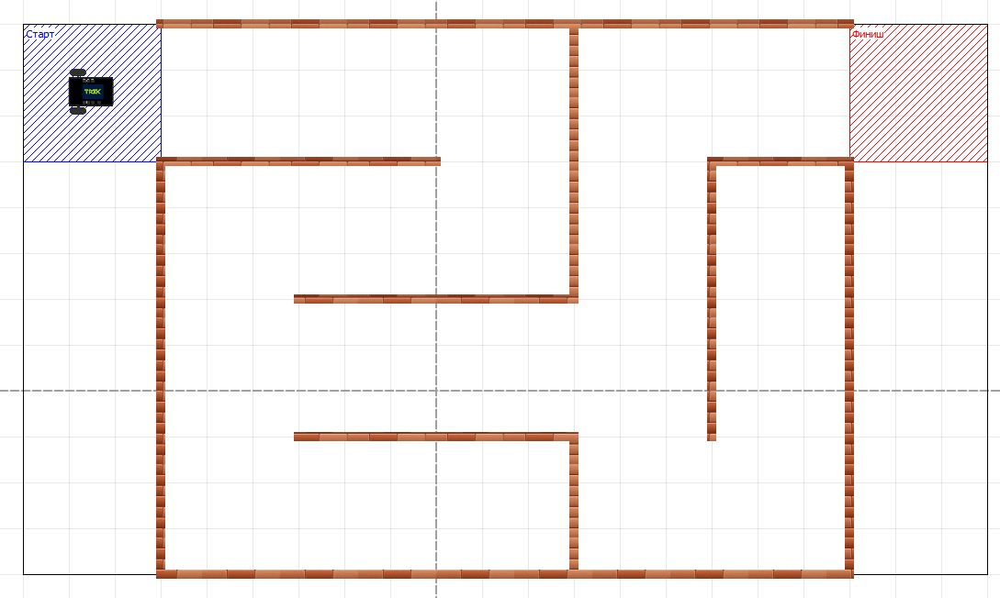
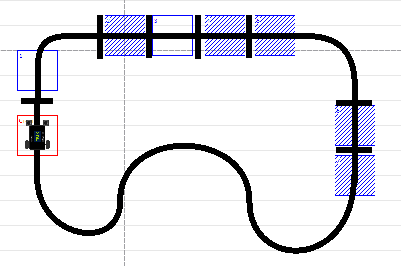

# Restrictions setting examples


This article is automatically translated from Russian by Google Translator.


Setting constraints is a unique feature of TRIK Studio designed for an automated check of tasks. This tool has many uses:

* self-examination of homework by students,
* accelerating the process of checking tasks by the teacher,
* online competitions with automatic checking of the participants' solutions.

The TRIK Studio constraint language is a very powerful tool that allows you to check almost all aspects of program execution and robot behavior and may seem complicated at first glance. However, don't be upset - in this article we will walk you through the process of creating constrained tasks, ranging from simple constraints that cover most of the tasks to complex constraints, which can be useful for enthusiasts.

* [Restricting the program execution time and the "Start" and "Finish" zones](untitled.md#restricting-the-program-execution-time-and-the-start-and-finish-zones)
* [Examples analysis](untitled.md#examples-analysis)
  * [Example 1. Drive from the "Start" zone to the "Finish" zone with a restriction of the movement zone](untitled.md#example-1-drive-from-the-start-zone-to-the-finish-zone-with-a-restriction-of-the-movement-zone)
  * [Example 2. Drive from the "Start" zone to the "Finish" zone with a stop](untitled.md#example-2-drive-from-the-start-zone-to-the-finish-zone-with-a-stop)
  * [Example 3. Drive from the "Start" zone to the "Finish" zone along the wall with the sensors checking](untitled.md#example-3-drive-from-the-start-zone-to-the-finish-zone-along-the-wall-with-the-sensors-checking)
  * [Example 4. Counting intersections and displaying the result](untitled.md#example-4-counting-intersections-and-displaying-the-result)
  * [Example 5. Kegelring](untitled.md#example-5-kegelring)
  * [Example 6. Checking robot behavior](untitled.md#example-6-checking-robot-behavior)

## Restricting the program execution time and the "Start" and "Finish" zones&#x20;

For those who are just starting to get acquainted with the TRIK Studio constraint language, we suggest starting with simple restrictions on the program run time, the "Start" and "Finish" zones. This is more than enough for most robotic tasks.

1\. Define the following conditions and parameters for the task and the world model.

* **Optimal program execution time.** If the program exceeds the timelimit, the checking system will generate an error "The program ran too long".
* **Start zone.** The zone from which the robot must start executing the program, otherwise the checking system will generate an error.
* **Finish zone.** The zone where the robot must arrive at the end of the program, otherwise the checking system will generate an error.

2\. Edit the value of the `<regions>` tag in the world XML file to add the Start and Finish zones. By changing the `x`, `y`, `width` and `height` values, you can edit the location and size of the zones. To check the position of a zone, load the file into the virtual world model and check the location of the zones. After that, if necessary, you can make the "Start" and "Finish" zones invisible by setting the attribute `visible="false"`.

```markup
<regions>
    <region type="rectangle" visible="true" color="blue" text="Старт" x="-450" y="-400" width="150" height="150" id="start_zone"/>
    <region type="rectangle" visible="true" color="green" text="Финиш" x="450" y="-400" width="150" height="150" id="finish_zone"/>
</regions>
```

3\. Copy the `<constraints>` block template below into the XML file of the world for which you want constraints.

```markup
<constraints>
    <!-- Restriction on program runtime -->
     <timelimit value="300000"/>

    <!-- Restriction, which will be checked once before starting the program -->
    <constraint checkOnce="true" failMessage="Робот должен находиться в зоне старта перед запуском!">
        <inside objectId="robot1" regionId="start_zone"/>
    </constraint>
    
    <!-- An event that verifies that the robot is in the finish area at the end of the program -->
    <event id="finish checker" settedUpInitially="true">
        <condition>
            <inside objectId="robot1" regionId="finish_zone"/>
        </condition>
        <trigger>
            <success/>
        </trigger>
    </event>
</constraints>
```

4\. Fill in the `<timelimit value="300000">` tag. Specify what you think is the best execution time for the program. Note that the time is in milliseconds, i.e., 300000ms = 5 minutes, 120,000ms = 2 minutes, etc.

5\. The constraint task is ready! Now you know how to check the start and end positions of the robot and the execution time of the program.

## Examples analysis

Now let's break down the application of this technique to different tasks and consider options for more detailed checks.

### Example 1. Drive from the "Start" zone to the "Finish" zone with a restriction of the movement zone

The task of passing the labyrinth. Having started in the blue square, it is necessary to pass to the finish area. In order to check that the user actually passes the labyrinth and not bypasses it, a spatial constraint is set.



Below is the complete code to test this task.

```markup
<?xml version='1.0' encoding='utf-8'?>
<root>
	<!-- World Description -->
	<world>
		<trace/>
		<walls>
			<wall end="450:-400" id="" begin="-300:-400"/>
			<wall end="-300:200" id="" begin="-300:-250"/>
			<wall end="450:200" id="" begin="-300:200"/>
			<wall end="450:200" id="" begin="450:-250"/>
			<wall end="150:-100" id="" begin="150:-400"/>
			<wall end="300:50" id="" begin="300:-250"/>
			<wall end="450:-250" id="" begin="300:-250"/>
			<wall end="-150:-250" id="" begin="-300:-250"/>
			<wall end="0:-250" id="" begin="-150:-250"/>
			<wall end="-150:-100" id="" begin="150:-100"/>
			<wall end="150:50" id="" begin="-150:50"/>
			<wall end="150:200" id="" begin="150:50"/>
		</walls>
		<colorFields/>
		<!-- Defining regions (zones) on the world map -->
		<regions>
			<region type="rectangle" visible="true" color="blue" text="Старт" x="-450" y="-400" width="150" height="150" id="start_zone"/>
			<region type="rectangle" visible="true" color="green" text="Финиш" x="450" y="-400" width="150" height="150" id="finish_zone"/>

			<region id="warzone" type="rectangle" filled="false" color="black" visible="true" x="-450" y="-400" width="1050" height="600"/>
		</regions>
	</world>
	<robots>
		<robot id="trikKitRobot" direction="0" position="-401:-351">
			<sensors>
				<sensor type="kitBase::robotModel::robotParts::Motor" direction="0" port="M4###output###JM4$$$D$$$4###" position="75:25"/>
				<sensor type="kitBase::robotModel::robotParts::Motor" direction="0" port="M3###output###JM3$$$C$$$3###" position="75:25"/>
				<sensor type="kitBase::robotModel::robotParts::Motor" direction="0" port="M2###output###JM2$$$B$$$2###" position="75:25"/>
				<sensor type="kitBase::robotModel::robotParts::Motor" direction="0" port="M1###output###JM1$$$A$$$1###" position="75:25"/>
			</sensors>
			<startPosition direction="0" x="-376" y="-326"/>
		</robot>
	</robots>
	<!-- Description of restrictions -->
	<constraints>
		<!-- Time limit of 5 minutes -->
		<timelimit value="300000"/> 
		
		<constraint checkOnce="true" failMessage="Робот должен находиться в зоне старта перед запуском!">
			<inside objectId="robot1" regionId="start_zone"/>
		</constraint>

		<!-- Restriction that verifies that the robot is in the allowed zone -->
		<constraint failMessage="Робот попытался объехать лабиринт!">
			<inside objectId="robot1" regionId="warzone"/>
		</constraint>

		<!-- An event that verifies that the robot is in the finish area at the end of the program -->
		<event id="finish checker" settedUpInitially="true">
			<condition>
				<inside objectId="robot1" regionId="finish_zone"/>
			</condition>
			<trigger>
				<success/>
			</trigger>
		</event>
	</constraints>
</root>
```

Let's take a closer look at how the check takes place.

**1.** Set a time limit for passing the task. This limit is mandatory. The time is specified in milliseconds.

```markup
<timelimit value="300000"/>
```

**2.** Set a constraint on the area where the robot should be before starting the program. According to the condition of the problem, it should be a blue square - the start area. This restriction will be checked once, at the beginning of the program, since the attribute `checkOnce` is `true`.

With the  [\<inside>](./#less-than-inside-greater-than) tag we set the spatial constraint. It has two attributes. In the first (objectId) we specify the id of the object whose location we want to check, in our case, it is a robot. In the second (regionId) we specify the id of the region in which our object should be located.

If the condition described in `<inside>` is not met, the program will be terminated with an error. For this, the [\<constraint>](./#less-than-constraint-greater-than-less-than-constraint-greater-than) tag has an attribute `failMessage`, which allows you to specify the text of the error message.

```markup
<constraint checkOnce="true" failMessage="The robot must be in the launch area before starting!">
    <inside objectId="robot1" regionId="start_zone"/>
</constraint>
```

**3.** In order to verify that the user actually goes through the maze and not bypasses it, let's set another spatial constraint.

Let's edit the `<regions>` tag in the XML file of the world by adding the region with `id = "warzone"`.

```markup
<region id="warzone" type="rectangle" filled="false" color="black" visible="true" x="-450" y="-400" width="1050" height="600"/>
```

This constraint will be checked at all times of program execution. In the [\<inside>](./#less-than-inside-greater-than) tag we will specify the object id and the region id, in our case, it is the robot and the black rectangle limiting the maze.

If the robot is outside the specified region at any time, the program will terminate with an error, the text of which is specified in the `failMessage` attribute.

```markup
<constraint failMessage="The robot tried to go around the maze!">
    <inside objectId="robot1" regionId="warzone"/>
</constraint>
```

**4.** Now we have to check that the robot reaches the finish area.

To do this, let's create an event that will check if the robot is in the right zone or not. The attribute `settedUpInitially="true"` means that the event will be started (fired) immediately when the program starts.

In the [\<condition>](./#less-than-conditions-greater-than-less-than-conditions-greater-than) tag we specify which condition to check. In our case the condition is the same as described above - we are checking that the robot is in the region with `id = "finish"`. If that condition is true, then the user will see a message saying that the program was executed successfully. To do that, we write a child tag [\<success/>](./#less-than-success-greater-than) in the [\<trigger>](./#less-than-trigger-greater-than-less-than-trigger-greater-than) tag.

```markup
<event id="finish checker" settedUpInitially="true">
    <!-- Condition-->
    <condition>
        <inside objectId="robot1" regionId="finish_zone"/>
    </condition>
    <!-- Trigger-->
    <trigger>
        <success/>
    </trigger>
</event>
```

### Example 2. Drive from the "Start" zone to the "Finish" zone with a stop

The task is to pass forward and stop in the finish area.

This task is slightly different from Example 1 in that another condition is added for successful completion of the program - the robot must not only be in the finish area, but also stop.


Below is the complete code to test this task.

```markup
<?xml version='1.0' encoding='utf-8'?>
<root version="20190819">
    <world>
    <!-- Defining regions (zones) on the world map -->
		<regions>
            <region id="finish_zone" text="Finish" textX="0" width="200" height="150" color="green" x="320" y="-50" visible="true" type="rectangle" filled="true" textY="0"/>
            <region id="start_zone" text="Start" textX="0" width="100" height="-100" color="#0000ff" x="-20" y="70" visible="true" type="rectangle" filled="true" textY="0"/>
			
						<region type="rectangle" id="warzone" text="Поле, которое нельзя покидать" x="-20" y="-140" width="610" height="320" color="orange" visible="true"/>
		</regions>
    </world>
    <robots>
        <robot id="trikKitRobot" direction="0" position="0:0">
            <sensors>
                <sensor port="M3###output###М3###" direction="0" position="75:25" type="kitBase::robotModel::robotParts::Motor"/>
                <sensor port="M4###output###М4###" direction="0" position="75:25" type="kitBase::robotModel::robotParts::Motor"/>
                <sensor port="M1###output###М1###" direction="0" position="75:25" type="kitBase::robotModel::robotParts::Motor"/>
                <sensor port="M2###output###М2###" direction="0" position="75:25" type="kitBase::robotModel::robotParts::Motor"/>
            </sensors>
            <startPosition id="{888338bf-3f53-44a4-ac0a-8aeea2d036b2}" y="25" direction="0" x="25"/>
            <wheels left="M3###output###М3###" right="M4###output###М4###"/>
        </robot>
    </robots>
    <settings realisticMotors="false" realisticSensors="false" realisticPhysics="false"/>
    <!-- Setting restrictions -->
    <constraints>
        <!-- Time limit -->
        <timelimit value="10000"/>
    
        <!-- Zone restriction on the start of the ride. Checked once at the beginning of the program-->
        <constraint checkOnce="true" failMessage="Робот должен находиться в синем квадрате перед запуском!">
            <inside objectId="robot1" regionId="start_zone"/>
        </constraint>
	    
	    	<!-- The robot is in the tolerance zone -->
	    	<constraint failMessage="Робот покинул допустимую зону!">
	    		<inside objectId="robot1" regionId="warzone"/>
	    	</constraint>
    
        <!-- Event indicating the successful execution of the program (finish area + robot stopped) -->
        <event id="finish checker" settedUpInitially="true">
            <conditions glue="and">
                <inside regionId="finish" objectId="robot1"/>
                <equals>
                    <objectState object="robot1.M3.power"/>
                    <int value="0"/>
                </equals>
                <equals>
                    <objectState object="robot1.M4.power"/>
                    <int value="0"/>
                </equals>
            </conditions>
            
            <trigger>
                <success/>
            </trigger>
        </event>
    </constraints>
</root>
```

Now let's take a closer look at how the check takes place.&#x20;

**1**. Let's set a time limit for passing the task.

```markup
<timelimit value="10000"/>
```

**2.** Let's set a constraint on the initial position of the robot. It will be checked once at the beginning of the program.

```markup
<constraint checkOnce="true" failMessage="The robot must be in the blue square before launching!">
    <inside objectId="robot1" regionId="start_zone"/>
</constraint>
```

**3.** Set a restriction on the area that the robot cannot leave.

```markup
<constraint failMessage="Робот покинул допустимую зону!">
    <inside objectId="robot1" regionId="warzone"/>
</constraint>
```

**4.** Now create an event that verifies that the robot is in the finish zone and that it has stopped in the finish zone and has not moved on.

The zone limit is set with the [\<inside>](./#less-than-inside-greater-than) tag. In order to check that the robot has stopped, we need to check that the power on both motors is zero. To do this we use the [\<equals>](./#less-than-equals-greater-than-less-than-equals-greater-than) tag. With the [\<objectState>](./#less-than-objectstate-greater-than) tag we define the object whose value we want to compare. In our case this is the power of the motors, so we will write `robot1.M3.power` or `robot1.M4.power` in the attribute `object`, where `M3` and `M4` are the ports to which the motors are connected in the current configuration. And the value to be compared we write using the[ \<int> ](./#less-than-int-greater-than)tag and its `value` attribute.

Thus, this event checks three conditions: the robot is in the finish area, the power on motor `M3` is zero and the power on motor `M4` is also zero. If these conditions are met the user will be shown a message about the successful execution of the program.

```markup
<event id="finish checker" settedUpInitially="true">
    <!-- Compound condition -->
    <conditions glue="and">
        <inside regionId="finish" objectId="robot1"/>
        
        <equals>
            <objectState object="robot1.M3.power"/>
            <int value="0"/>
        </equals>
        
        <equals>
            <objectState object="robot1.M4.power"/>
            <int value="0"/>
        </equals>
    </conditions>
    
    <trigger>
        <success/>
    </trigger>
</event>
```

### Example 3. Drive from the "Start" zone to the "Finish" zone along the wall with the sensors checking

Having started in the blue square, you must drive along the wall with the IR distance sensor to the red square.


Below is the complete code for checking this task.

```markup
<?xml version='1.0' encoding='utf-8'?>
<root version="20190819">
    <world>
        <walls>
            <wall stroke-width="10" end="-110:50" stroke="#ff000000" begin="-200:50" stroke-style="none" fill="#ff000000" id="{f148f786-7d73-4c42-a3aa-c7a29892d3d7}"/>
            <wall stroke-width="10" end="0:100" stroke="#ff000000" begin="-110:50" stroke-style="none" fill="#ff000000" id="{8f39faac-9392-4878-86e9-9fe5dbea0007}"/>
            <wall stroke-width="10" end="250:110" stroke="#ff000000" begin="0:100" stroke-style="none" fill="#ff000000" id="{bf465864-fa2e-4b59-ac65-e27bd85300d5}"/>
            <wall stroke-width="10" end="350:160" stroke="#ff000000" begin="250:110" stroke-style="none" fill="#ff000000" id="{ba5441dd-8dd8-4100-ad8b-66d634792e3f}"/>
            <wall stroke-width="10" end="400:260" stroke="#ff000000" begin="350:160" stroke-style="none" fill="#ff000000" id="{ca85b1de-8e9c-49e9-8c40-c2c49f43dcaa}"/>
        </walls>
        <skittles/>
        <balls/>
        <colorFields/>
        <images/>
        <regions>
            <region visible="true" type="rectangle" x="350" filled="true" y="50" width="150" height="200" id="good_zone3" color="#ffff00"/>
            <region visible="true" type="rectangle" x="-250" filled="true" y="-50" width="150" textY="0" height="100" text="Start" id="start_zone" textX="0" color="#0000ff"/>
            <region visible="true" type="rectangle" x="0" filled="true" y="0" width="400" height="150" id="good_zone2" color="#ffff00"/>
            <region visible="true" type="rectangle" x="400" filled="true" y="150" width="100" textY="0" height="100" text="Finish" id="finish" textX="0" color="#ff0000"/>
            <region visible="true" type="rectangle" x="-200" filled="true" y="-50" width="250" height="150" id="good_zone1" color="#ffff00"/>
        </regions>
    </world>
    <robots>
        <robot direction="0" position="-200:-25" id="trikKitRobot">
            <sensors>
                <sensor type="trik::robotModel::parts::TrikInfraredSensor" direction="69.6769" position="42:18" port="A1###input###А1###sensorA1"/>
                <sensor type="kitBase::robotModel::robotParts::Motor" direction="0" position="75:25" port="M4###output###М4###"/>
                <sensor type="kitBase::robotModel::robotParts::Motor" direction="0" position="75:25" port="M3###output###М3###"/>
                <sensor type="" direction="0" position="0:0" port="A5###input###А5###sensorA5"/>
                <sensor type="" direction="0" position="0:0" port="A6###input###А6###sensorA6"/>
            </sensors>
            <startPosition direction="0" x="-175" y="0" id="{84223544-d500-411a-9fdb-b382eb98d09f}"/>
            <wheels right="M3###output###М3###" left="M4###output###М4###"/>
        </robot>
    </robots>
    <settings realisticPhysics="false" realisticSensors="false" realisticMotors="false"/>
    <constraints>
        <!-- Time Limit. Mandatory Limit -->
        <timelimit value="40000"/>
        <!-- Check that a distance sensor is installed on port A1 -->
        <constraint checkOnce="true" failMessage="У робота должен быть установлен датчик расстояния на порт А1">
            <equals>
                <typeOf objectId="robot1.A1"/>
                <string value="twoDModel::robotModel::parts::RangeSensor"/>
            </equals>
        </constraint>
        <!-- Check that there are no sensors other than the distance sensor -->
        <constraint checkOnce="true" failMessage="У робота не должно быть датчиков, кроме датчика расстояния">
            <conditions glue="and">
                <equals>
                    <typeOf objectId="robot1.A2"/>
                    <string value="undefined"/>
                </equals>
                <equals>
                    <typeOf objectId="robot1.A3"/>
                    <string value="undefined"/>
                </equals>
                <equals>
                    <typeOf objectId="robot1.A4"/>
                    <string value="undefined"/>
                </equals>
                <equals>
                    <typeOf objectId="robot1.A5"/>
                    <string value="undefined"/>
                </equals>
                <equals>
                    <typeOf objectId="robot1.A6"/>
                    <string value="undefined"/>
                </equals>
                <equals>
                    <typeOf objectId="robot1.D1"/>
                    <string value="undefined"/>
                </equals>
                <equals>
                    <typeOf objectId="robot1.D2"/>
                    <string value="undefined"/>
                </equals>
                <equals>
                    <typeOf objectId="robot1.F1"/>
                    <string value="undefined"/>
                </equals>
            </conditions>
        </constraint>

        <!-- Zone restriction on the start of the ride. Checked once at the beginning of the program -->
        <constraint checkOnce="true" failMessage="Робот должен находиться в синей зоне перед стартом!">
            <inside objectId="robot1" regionId="start_zone"/>
        </constraint>
        <!-- Checks that the robot is in a valid region for the duration of the program -->
        <constraint failMessage="Робот покинул допустимую зону!">
            <conditions glue="or">
                <inside objectId="robot1" regionId="good_zone1"/>
                <inside objectId="robot1" regionId="good_zone2"/>
                <inside objectId="robot1" regionId="good_zone3"/>
            </conditions>
        </constraint>
        <!-- Event that notifies of successful program execution -->
        <event id="finish checker" settedUpInitially="true">
            <condition>
                <inside objectId="robot1" regionId="finish"/>
            </condition>
            <trigger>
                <success/>
            </trigger>
        </event>
    </constraints>
</root>

```

Now let's take a closer look at how the check takes place.&#x20;

**1.** Let's set a time limit for the task.

```markup
<timelimit value="40000"/>
```

**2.** According to the problem condition, the robot must have only the distance sensor connected (there must be no other sensors). To be sure of this, let's compare the value of the object on port `A1` with the value of the distance sensor. For more information about the names of the sensors for different constructors, see the [link](./#nazvaniya-datchikov).

```markup
<constraint checkOnce="true" failMessage="The robot must have a distance sensor installed on port A1">
    <equals>
        <typeOf objectId="robot1.A1"/>
        <string value="twoDModel::robotModel::parts::RangeSensor"/>
    </equals>
</constraint>
```

**3**. Let's check that no sensors are connected to the other ports. To do this, compare the value on each port with the `"undefined"` string.

```markup
<constraint checkOnce="true" failMessage="The robot should have no sensors other than the distance sensor">
    <conditions glue="and">
        <equals>
            <typeOf objectId="robot1.A2"/>
            <string value="undefined"/>
        </equals>
        <equals>
            <typeOf objectId="robot1.A3"/>
            <string value="undefined"/>
        </equals>
        <equals>
            <typeOf objectId="robot1.A4"/>
            <string value="undefined"/>
        </equals>
        <equals>
            <typeOf objectId="robot1.A5"/>
            <string value="undefined"/>
        </equals>
        <equals>
            <typeOf objectId="robot1.A6"/>
            <string value="undefined"/>
        </equals>
        <equals>
            <typeOf objectId="robot1.D1"/>
            <string value="undefined"/>
        </equals>
        <equals>
            <typeOf objectId="robot1.D2"/>
            <string value="undefined"/>
        </equals>
        <equals>
            <typeOf objectId="robot1.F1"/>
            <string value="undefined"/>
        </equals>
    </conditions>
</constraint>
```

**4**. Let's set a constraint on the initial position of the robot. It will be checked once at the beginning of the program because the `checkOnce` flag is set.

```markup
<constraint checkOnce="true" failMessage="The robot must be in the blue square before launching!">
    <inside objectId="robot1" regionId="start_zone"/>
</constraint>
```

**5.** Let's set a restriction on the zone that the robot can't leave. In the previous examples, we considered a situation where the robot needed to stay in one zone. In this case, the allowed zone consists of several rectangles, so we need to check that the robot is in one of those zones. To do that we use the `<conditions></conditions>` tag with the `glue = "or"` attribute.

```markup
<constraint failMessage="The robot has left the tolerance zone!">
    <conditions glue="or">
        <inside objectId="robot1" regionId="good_zone1"/>
        <inside objectId="robot1" regionId="good_zone2"/>
        <inside objectId="robot1" regionId="good_zone3"/>
    </conditions>
</constraint>
```

**6.** Finally, let's create an event that will notify you if the robot is in the finish area.

```markup
<event id="finish checker" settedUpInitially="true">
    <condition>
        <inside objectId="robot1" regionId="finish"/>
    </condition>
    <trigger>
        <success/>
    </trigger>
</event>
```

### Example 4. Counting intersections and displaying the result

Linear traffic with intersection counting: when entering an intersection, the robot should display the number of this intersection on the screen.



Below is the complete code for checking this task.

```markup
<?xml version='1.0' encoding='utf-8'?>
<root version="20190819">
    <world>
        <walls/>
        <skittles/>
        <balls/>
        <colorFields>
            <cubicBezier id="{6199f811-617a-463d-848f-39b28b918584}" stroke-style="solid" fill-style="none" stroke="#ff000000" begin="-174.411:98.5051" cp1="-173.503:9.71619" stroke-width="12" cp2="-184.608:-31.2306" fill="#ff000000" end="-103.03:-28.2828"/>
            <line id="{311aba08-eff0-4d50-98f1-fc7595e22b79}" stroke-style="solid" fill-style="none" stroke="#ff000000" begin="-97.2997:-28.5387" stroke-width="12" fill="#ff000000" end="353.7:-28.5387"/>
            <line id="{e4428c3f-4ef1-4214-b5be-9a22eb4f875e}" stroke-style="solid" fill-style="none" stroke="#ff000000" begin="-175.556:244" stroke-width="12" fill="#ff000000" end="-175.556:106.222"/>
            <line id="{c921474d-3f18-4f98-b3fd-c83fa6e712b8}" stroke-style="solid" fill-style="none" stroke="#ff000000" begin="-202.02:102.353" stroke-width="12" fill="#ff000000" end="-149.459:102.353"/>
            <line id="{5f4000d6-8494-45bb-8e0c-44a5779f3140}" stroke-style="solid" fill-style="none" stroke="#ff000000" begin="-49.8316:-64.6465" stroke-width="12" fill="#ff000000" end="-49.8316:11.4478"/>
            <line id="{c20e8d67-e66b-4cd1-a4d5-da909d32717a}" stroke-style="solid" fill-style="none" stroke="#ff000000" begin="48.2829:-65.5219" stroke-width="12" fill="#ff000000" end="48.2829:10.5724"/>
            <line id="{3abe2138-f488-429d-bb27-94b6a13c913e}" stroke-style="solid" fill-style="none" stroke="#ff000000" begin="146.599:-64.8485" stroke-width="12" fill="#ff000000" end="146.599:11.2458"/>
            <line id="{ccaf1f51-b4b8-4ed4-9110-cf08067e7bf4}" stroke-style="solid" fill-style="none" stroke="#ff000000" begin="249.63:-65.5219" stroke-width="12" fill="#ff000000" end="249.63:10.5724"/>
            <line id="{6866e178-6a20-4048-8eab-ed3554098cd4}" stroke-style="solid" fill-style="none" stroke="#ff000000" begin="460.157:66.3198" stroke-width="12" fill="#ff000000" end="460.157:260.178"/>
            <cubicBezier id="{47001b3d-8af4-432d-8e66-9cc7728f2a39}" stroke-style="solid" fill-style="none" stroke="#ff000000" begin="358.194:-28.399" cp1="438.051:-29.9289" stroke-width="12" cp2="457.133:13.7415" fill="#ff000000" end="459.881:62.7527"/>
            <cubicBezier id="{edb3034d-f57c-4349-a714-3439433d2db2}" stroke-style="solid" fill-style="none" stroke="#ff000000" begin="458.622:252.499" cp1="457.591:441.101" stroke-width="12" cp2="251.469:440.071" fill="#ff000000" end="249.408:304.03"/>
            <cubicBezier id="{ff2677c7-98f1-46e0-b17c-197a3d94e664}" stroke-style="solid" fill-style="none" stroke="#ff000000" begin="249.408:304.03" cp1="251.469:155.622" stroke-width="12" cp2="-10.3061:151.5" fill="#ff000000" end="-9.27549:302.999"/>
            <cubicBezier id="{c841736a-ce7b-4bc4-90bb-7bb72bb7dd99}" stroke-style="solid" fill-style="none" stroke="#ff000000" begin="-9.27549:302.999" cp1="-9.02218:404.61" stroke-width="12" cp2="-177.667:378.931" fill="#ff000000" end="-175.204:250.438"/>
            <line id="{34475443-f1cf-4718-bb44-bd4bfc7221bf}" stroke-style="solid" fill-style="none" stroke="#ff000000" begin="428.351:105.655" stroke-width="12" fill="#ff000000" end="489.769:105.655"/>
            <line id="{9e883af6-6280-4577-b0da-608011ca26ed}" stroke-style="solid" fill-style="none" stroke="#ff000000" begin="428.197:199.401" stroke-width="12" fill="#ff000000" end="489.615:199.401"/>
        </colorFields>
        <images/>
        <regions>
            <region id="region_1" type="rectangle" textX="0" width="80" textY="0" visible="true" y="0" text="1" filled="true" height="80" color="#0000ff" x="-215"/>
            <region id="region_2" type="rectangle" textX="0" width="80" textY="0" visible="true" y="-70" text="2" filled="true" height="80" color="#0000ff" x="-40"/>
            <region id="region_3" type="rectangle" textX="0" width="80" textY="0" visible="true" y="-70" text="3" filled="true" height="80" color="#0000ff" x="55"/>
            <region id="region_4" type="rectangle" textX="0" width="80" textY="0" visible="true" y="-70" text="4" filled="true" height="80" color="#0000ff" x="160"/>
            <region id="region_5" type="rectangle" textX="0" width="80" textY="0" visible="true" y="-70" text="5" filled="true" height="80" color="#0000ff" x="260"/>
            <region id="region_6" type="rectangle" textX="0" width="80" textY="0" visible="true" y="110" text="6" filled="true" height="80" color="#0000ff" x="420"/>
            <region id="region_7" type="rectangle" textX="0" width="80" textY="0" visible="true" y="210" text="7" filled="true" height="80" color="#0000ff" x="420"/>
            <region id="start_zone" type="rectangle" textX="0" width="80" textY="0" visible="true" y="130" text="Старт" filled="true" height="80" color="#ff0000" x="-215"/>
        </regions>
    </world>
    <robots>
        <robot id="trikKitRobot" position="-199.667:149.444" direction="-90">
            <sensors>
                <sensor type="kitBase::robotModel::robotParts::Motor" port="M3###output###М3###" position="75:25" direction="0"/>
                <sensor type="" port="A1###input###JA1###sensorA1" position="0:0" direction="0"/>
                <sensor type="" port="A2###input###JA2###sensorA2" position="0:0" direction="0"/>
                <sensor type="" port="LineSensorPort###input###TrikLineSensorPort###lineSensor" position="0:0" direction="0"/>
                <sensor type="kitBase::robotModel::robotParts::EncoderSensor" port="E3###input###M3$$$Е3###encoder3" position="75:25" direction="0"/>
                <sensor type="kitBase::robotModel::robotParts::EncoderSensor" port="E4###input###M4$$$Е4###encoder4" position="75:25" direction="0"/>
                <sensor type="trik::robotModel::parts::TrikLightSensor" port="A5###input###А5###sensorA5" position="54:42" direction="0"/>
                <sensor type="trik::robotModel::parts::TrikLightSensor" port="A6###input###А6###sensorA6" position="54:8" direction="0"/>
                <sensor type="kitBase::robotModel::robotParts::Motor" port="M4###output###М4###" position="75:25" direction="0"/>
            </sensors>
            <startPosition id="{9f3c8967-8967-4a0d-a118-ba8041db8a37}" y="174.444" direction="-90" x="-174.667"/>
            <wheels left="M3###output###М3###" right="M4###output###М4###"/>
        </robot>
    </robots>
    <settings realisticMotors="false" realisticSensors="false" realisticPhysics="true"/>
    <constraints>
        <timelimit value="50000"/>
        <constraint failMessage="The robot must be in the launch area before starting!" checkOnce="true">
            <inside regionId="start_zone" objectId="robot1"/>
        </constraint>
        <event id="id_1" settedUpInitially="true">
            <conditions glue="and">
                <inside regionId="region_1" objectId="robot1"/>
                <equals>
                    <objectState object="robot1.display.labels.last.text"/>
                    <string value="1"/>
                </equals>
            </conditions>
            <trigger>
                <setUp id="id_2"/>
            </trigger>
        </event>
        <event id="id_1_fail" settedUpInitially="true">
            <conditions glue="and">
                <inside regionId="region_1" objectId="robot1"/>
                <notEqual>
                    <objectState object="robot1.display.labels.last.text"/>
                    <string value="1"/>
                </notEqual>
            </conditions>
            <trigger>
                <fail message="Invalid intersection number! Please note that the junction number should be displayed as the last line"/>
            </trigger>
        </event>
        <event id="id_2" settedUpInitially="false">
            <conditions glue="and">
                <inside regionId="region_2" objectId="robot1"/>
                <equals>
                    <objectState object="robot1.display.labels.last.text"/>
                    <string value="2"/>
                </equals>
            </conditions>
            <trigger>
                <setUp id="id_3"/>
            </trigger>
        </event>
        <event id="id_3" settedUpInitially="false">
            <conditions glue="and">
                <inside regionId="region_3" objectId="robot1"/>
                <equals>
                    <objectState object="robot1.display.labels.last.text"/>
                    <string value="3"/>
                </equals>
            </conditions>
            <trigger>
                <setUp id="id_4"/>
            </trigger>
        </event>
        <event id="id_4" settedUpInitially="false">
            <conditions glue="and">
                <inside regionId="region_4" objectId="robot1"/>
                <equals>
                    <objectState object="robot1.display.labels.last.text"/>
                    <string value="4"/>
                </equals>
            </conditions>
            <trigger>
                <setUp id="id_5"/>
            </trigger>
        </event>
        <event id="id_5" settedUpInitially="false">
            <conditions glue="and">
                <inside regionId="region_5" objectId="robot1"/>
                <equals>
                    <objectState object="robot1.display.labels.last.text"/>
                    <string value="5"/>
                </equals>
            </conditions>
            <trigger>
                <setUp id="id_6"/>
            </trigger>
        </event>
        <event id="id_6" settedUpInitially="false">
            <conditions glue="and">
                <inside regionId="region_6" objectId="robot1"/>
                <equals>
                    <objectState object="robot1.display.labels.last.text"/>
                    <string value="6"/>
                </equals>
            </conditions>
            <trigger>
                <setUp id="id_7"/>
            </trigger>
        </event>
        <event id="id_7" settedUpInitially="false">
            <conditions glue="and">
                <inside regionId="region_7" objectId="robot1"/>
                <equals>
                    <objectState object="robot1.display.labels.last.text"/>
                    <string value="7"/>
                </equals>
            </conditions>
            <trigger>
                <success/>
            </trigger>
        </event>
    </constraints>
</root>

```

Let's take a look at how verification works.

**1.** After each intersection, set the zones where it will be checked that the correct intersection number is displayed. To do this, edit the value of the [\<regions>](../settings.md#less-than-region-greater-than) tag in the XML file of the world, adding there the necessary number of zones to check. By changing the values of `x`, `y`, `width` and `height`, you can edit the location and size of the zones. To check the position of a zone, load the file into the virtual world model and check the location of the zones. After that, if necessary, you can make zones invisible by setting the attribute `visible="false"`.

```markup
<!-- Example zone -->
<region id="region_1" type="rectangle" textX="0" width="80" textY="0" visible="true" y="0" text="1" filled="true" height="80" color="#0000ff" x="-215"/>
```

**2.** After that, in the [\<constraints>](./#less-than-constraints-greater-than-less-than-constraints-greater-than)  block set the constraint check. First we will specify the limit on the execution time of the task.

```markup
<timelimit value="50000"/>
```

**3.** Let's set a constraint on the initial position of the robot.

```markup
<constraint failMessage="The robot must be in the launch area before starting!" checkOnce="true">
    <inside regionId="start_zone" objectId="robot1"/>
</constraint>
```

**4.** In each zone after the intersection, we will check that the correct number is displayed. To do this, specify the `id` of the desired region in the [\<inside>](./#inside) tag and check that the last displayed message (`robot1.display.labels.last.text`) equals the number of the passed intersection. After that, we will call the same events for the rest of the zones.

```markup
<event id="id_1" settedUpInitially="true">
    <conditions glue="and">
        <inside regionId="region_1" objectId="robot1"/>
        <equals>
            <objectState object="robot1.display.labels.last.text"/>
            <string value="1"/>
        </equals>
    </conditions>
    <trigger>
        <setUp id="id_2"/>
    </trigger>
</event>
```

**5.** We will display an error message if the wrong number is displayed. To do this, compare the message that was displayed with the expected correct value. If the messages don't match, the user will get the specified error message and the program will stop executing.

```markup
<event id="id_1_fail" settedUpInitially="true">
    <conditions glue="and">
        <inside regionId="region_1" objectId="robot1"/>
        <notEqual>
            <objectState object="robot1.display.labels.last.text"/>
            <string value="1"/>
        </notEqual>
    </conditions>
    <trigger>
        <fail message="Неверный номер перекрестка! Обратите внимание, что номер перекрестка должен выводиться последней строчкой"/>
    </trigger>
</event>
```

**6.** Set the event that will display a message about the successful execution of the program, if all the specified intersections are passed correctly.

```markup
<event id="id_7" settedUpInitially="false">
    <conditions glue="and">
        <inside regionId="region_7" objectId="robot1"/>
        <equals>
            <objectState object="robot1.display.labels.last.text"/>
            <string value="7"/>
        </equals>
    </conditions>
    <trigger>
        <success/>
    </trigger>
</event>
```

### Example 5. Kegelring

The robot must push all pins outside the circle.


Below is the complete code for checking this task.

```markup
<?xml version='1.0' encoding='utf-8'?>
<root version="20190819">
    <world>
        <walls/>
        <skittles>
            <skittle markerY="0.107756" y="0.107756" rotation="0" startRotation="0" id="{skittle1}" x="-90.3433" markerX="-90.3433"/>
            <skittle markerY="62.9765" y="62.9765" rotation="0" startRotation="0" id="{skittle2}" x="-63.8519" markerX="-63.8519"/>
            <skittle markerY="62.963" y="62.963" rotation="0" startRotation="0" id="{skittle3}" x="62.3031" markerX="62.3031"/>
            <skittle markerY="-89.2259" y="-89.2259" rotation="0" startRotation="0" id="{skittle4}" x="-0.323222" markerX="-0.323222"/>
            <skittle markerY="89.0101" y="89.0101" rotation="0" startRotation="0" id="{skittle5}" x="-1.45453" markerX="-1.45453"/>
            <skittle markerY="-1.44107" y="-1.44107" rotation="0" startRotation="0" id="{skittle6}" x="88.1212" markerX="88.1212"/>
            <skittle markerY="-63.1785" y="-63.1785" rotation="0" startRotation="0" id="{skittle7}" x="62.3031" markerX="62.3031"/>
            <skittle markerY="-64.7408" y="-64.7408" rotation="0" startRotation="0" id="{skittle8}" x="-63.8519" markerX="-63.8519"/>
        </skittles>
        <balls/>
        <colorFields/>
        <images>
            <image imageId="{ed8c2ee9-a500-4993-b874-611ba6b78853}" id="{d91a151a-4519-4646-89fd-395c863b5e77}" isBackground="false" rect="0:0:-6:-6" position="0:0"/>
            <image imageId="{9275be02-a681-4b9f-981e-56bcb9f17cee}" id="{8f470550-4bb5-4b34-b46e-c349d686bd9a}" isBackground="false" rect="0:0:-6:-6" position="0:0"/>
            <image imageId="{229679a6-12a5-44d0-97d9-99f132ded1e2}" id="{5dcb114e-03d4-493b-9849-daf4cd364a2a}" isBackground="false" rect="0:0:-6:-6" position="0:0"/>
            <image imageId="{27036474-ec49-423d-9f20-141d0c7d1044}" id="{ebb8366d-61c7-422f-9460-865851d1e0f1}" isBackground="false" rect="0:0:-6:-6" position="0:0"/>
            <image imageId="{69f0b63a-2937-4b12-bad7-2e240210db2e}" id="{f7bd0d83-ae88-46c8-bd9e-95fd3c32c174}" isBackground="false" rect="0:0:-6:-6" position="0:0"/>
            <image imageId="{80069e12-f4e6-4d56-8487-d8d4dd9e5ce2}" id="{1345cda3-f2e1-49b9-ae6b-35b4aa2eb850}" isBackground="false" rect="0:0:-6:-6" position="0:0"/>
            <image imageId="{7904d24c-5993-4013-80b5-bc899c0daabf}" id="{116c53b9-aa2c-4a16-bf8c-d291629c416f}" isBackground="false" rect="0:0:-4:-4" position="0:0"/>
            <image imageId="{742a7dc4-05a6-47c2-87fc-d04f1b3f0be4}" id="{9ee0c06d-b9c0-4da8-8227-98ffdc24f0be}" isBackground="false" rect="-200:-201:399:401" position="0:0"/>
        </images>
        <regions>
            <region type="ellipse" filled="true" textY="0" y="-150" visible="true" width="300" text="Ring" id="warzone" x="-150" height="300" textX="0" color="#ff0000"/>
        </regions>
    </world>
    <robots>
        <robot direction="0" id="trikKitRobot" position="-25:-24.4321">
            <sensors>
                <sensor type="kitBase::robotModel::robotParts::EncoderSensor" direction="0" port="E1###input###M1$$$Е1###encoder1" position="75:25"/>
                <sensor type="trik::robotModel::parts::TrikLightSensor" direction="0" port="A5###input###А5###sensorA5" position="50:25"/>
                <sensor type="kitBase::robotModel::robotParts::EncoderSensor" direction="0" port="E2###input###M2$$$Е2###encoder2" position="75:25"/>
                <sensor type="trik::robotModel::parts::TrikLightSensor" direction="0" port="A3###input###А3###sensorA3" position="56:43"/>
                <sensor type="kitBase::robotModel::robotParts::Motor" direction="0" port="M2###output###М2###" position="75:25"/>
                <sensor type="trik::robotModel::parts::TrikInfraredSensor" direction="0" port="A1###input###А1###sensorA1" position="22:25"/>
                <sensor type="kitBase::robotModel::robotParts::Motor" direction="0" port="M1###output###М1###" position="75:25"/>
                <sensor type="kitBase::robotModel::robotParts::Motor" direction="0" port="M4###output###М4###" position="75:25"/>
                <sensor type="trik::robotModel::parts::TrikLightSensor" direction="0" port="A2###input###А2###sensorA2" position="56:5"/>
                <sensor type="kitBase::robotModel::robotParts::Motor" direction="0" port="M3###output###М3###" position="75:25"/>
                <sensor type="kitBase::robotModel::robotParts::EncoderSensor" direction="0" port="E3###input###M3$$$Е3###encoder3" position="75:25"/>
                <sensor type="kitBase::robotModel::robotParts::EncoderSensor" direction="0" port="E4###input###M4$$$Е4###encoder4" position="75:25"/>
            </sensors>
            <startPosition y="0.567901" direction="0" id="{2b1161e8-ba72-40ed-bf22-be49c2ab4cb9}" x="0"/>
            <wheels left="M4###output###М4###" right="M3###output###М3###"/>
        </robot>
    </robots>
    <settings realisticSensors="false" realisticPhysics="true" realisticMotors="false"/>
    <constraints>
        <timelimit value="60000"/>
        <constraint failMessage="Робот должен находиться в круге перед запуском!" checkOnce="true">
            <inside objectId="robot1" regionId="warzone"/>
        </constraint>
        <event settedUpInitially="true">
            <condition>
                <timer forceDropOnTimeout="true" timeout="100"/>
            </condition>
            <trigger>
                <setUp id="finish checker"/>
            </trigger>
        </event>
        <event id="finish checker" settedUpInitially="false">
            <conditions glue="and">
                <not>
                    <inside objectId="{skittle1}" regionId="warzone"/>
                </not>
                <not>
                    <inside objectId="{skittle2}" regionId="warzone"/>
                </not>
                <not>
                    <inside objectId="{skittle3}" regionId="warzone"/>
                </not>
                <not>
                    <inside objectId="{skittle4}" regionId="warzone"/>
                </not>
                <not>
                    <inside objectId="{skittle5}" regionId="warzone"/>
                </not>
                <not>
                    <inside objectId="{skittle6}" regionId="warzone"/>
                </not>
                <not>
                    <inside objectId="{skittle7}" regionId="warzone"/>
                </not>
                <not>
                    <inside objectId="{skittle8}" regionId="warzone"/>
                </not>
            </conditions>
            <trigger>
                <success/>
            </trigger>
        </event>
    </constraints>
</root>
```

Now let's look in more detail at how the check takes place.

**1.** Let's edit the XML file of the world by adding a circle zone to the [\<regions>](../settings.md#less-than-region-greater-than) tag.

```markup
<region type="ellipse" filled="true" textY="0" y="-150" visible="true" width="300" text="Ring" id="warzone" x="-150" height="300" textX="0" color="#ff0000"/>
```


**2.** Let's set a time limit for the task.

```markup
<timelimit value="60000"/>
```

**3.** Let's set a constraint on the initial position of the robot.

```markup
<constraint failMessage="Робот должен находиться в круге перед запуском!" checkOnce="true">
    <inside objectId="robot1" regionId="warzone"/>
</constraint>
```

**4.** Set an event that checks that all pins are outside the circle, and then displays a message that the program has been successfully executed.

```markup
<event id="finish checker" settedUpInitially="false">
    <conditions glue="and">
        <not>
            <inside objectId="{skittle1}" regionId="warzone"/>
        </not>
        <not>
            <inside objectId="{skittle2}" regionId="warzone"/>
        </not>
        <not>
            <inside objectId="{skittle3}" regionId="warzone"/>
        </not>
        <not>
            <inside objectId="{skittle4}" regionId="warzone"/>
        </not>
        <not>
            <inside objectId="{skittle5}" regionId="warzone"/>
        </not>
        <not>
            <inside objectId="{skittle6}" regionId="warzone"/>
        </not>
        <not>
            <inside objectId="{skittle7}" regionId="warzone"/>
        </not>
        <not>
            <inside objectId="{skittle8}" regionId="warzone"/>
        </not>
    </conditions>
    <trigger>
        <success/>
    </trigger>
</event>
```

### Example 6. Checking robot behavior

In the start position the robot must be in the start area at a distance from the wall and a touch sensor must be connected to port A1. A successful pass is when the robot approaches the wall, touches it with the touch sensor, moves away from it, and so on 5 times.


The idea of the checking program is that at any given time either the event waiting for the robot to drive up to the wall or that it has gone back is triggered. Both of these events arm each other. When the robot returns to its original position, the iteration counter is incremented. There is an extra event that checks the counter value. It will display a message about the successful execution of the program when the value is five.

Below is the complete code for checking this task.

```markup
<?xml version='1.0' encoding='utf-8'?>
<root version="20190819">
    <world>
        <walls>
            <wall fill="#ff000000" stroke-width="0" stroke="#ff000000" begin="-68:-204" id="{6f8bd6be-2983-4b0b-bbf8-5a26d1ed1ef7}" end="-68:77" stroke-style="none"/>
        </walls>
        <skittles/>
        <balls/>
        <colorFields/>
        <images/>
        <regions>
            <region x="-270" textY="0" y="-110" text="Стартовое поле" id="start_zone" color="#0000ff" filled="true" width="80" visible="true" textX="0" type="rectangle" height="80"/>
            <region x="-280" textY="0" y="-230" text="Поле, которое нельзя покидать" id="warzone" color="#ffff00" filled="true" width="210" visible="false" textX="0" type="rectangle" height="285"/>
        </regions>
    </world>
    <robots>
        <robot position="-256:-103" id="trikKitRobot" direction="0">
            <sensors>
                <sensor port="A5###input###А5###sensorA5" position="0:0" type="" direction="0"/>
                <sensor port="M3###output###М3###" position="75:25" type="kitBase::robotModel::robotParts::Motor" direction="0"/>
                <sensor port="M4###output###М4###" position="75:25" type="kitBase::robotModel::robotParts::Motor" direction="0"/>
                <sensor port="A1###input###А1###sensorA1" position="75:25" type="trik::robotModel::parts::TrikTouchSensor" direction="0"/>
            </sensors>
            <startPosition x="-231" y="-78" id="{99807fe9-54b1-42d7-991b-2b9cf102abe7}" direction="0"/>
            <wheels left="M4###output###М4###" right="M3###output###М3###"/>
        </robot>
    </robots>
    <settings realisticPhysics="false" realisticMotors="false" realisticSensors="false"/>
    <constraints>
        <!-- Time limit of 30 seconds -->
        <timelimit value="300000"/>
        <!-- Check that a touch sensor is installed on port A1 -->
        <constraint checkOnce="true" failMessage="На порту А1 должен быть выставлен датчик касания">
            <equals>
                <typeof objectId="robot1.А1"/>
                <string value="twoDModel::robotModel::parts::TouchSensor"/>
            </equals>
        </constraint>
        <!-- Check that there are no sensors other than the touch sensor on port A1 -->
        <constraint checkOnce="true" failMessage="The robot should have no sensors other than the touch sensor on port A1">
            <conditions glue="and">
                <equals>
                    <typeOf objectId="robot1.A2"/>
                    <string value="undefined"/>
                </equals>
                <equals>
                    <typeOf objectId="robot1.A3"/>
                    <string value="undefined"/>
                </equals>
                <equals>
                    <typeOf objectId="robot1.A4"/>
                    <string value="undefined"/>
                </equals>
                <equals>
                    <typeOf objectId="robot1.A5"/>
                    <string value="undefined"/>
                </equals>
                <equals>
                    <typeOf objectId="robot1.A6"/>
                    <string value="undefined"/>
                </equals>
                <equals>
                    <typeOf objectId="robot1.D1"/>
                    <string value="undefined"/>
                </equals>
                <equals>
                    <typeOf objectId="robot1.D2"/>
                    <string value="undefined"/>
                </equals>
                <equals>
                    <typeOf objectId="robot1.F1"/>
                    <string value="undefined"/>
                </equals>
            </conditions>
        </constraint>
        <!-- Check that the robot is in the valid zone during the program run time -->
        <constraint failMessage="Робот покинул допустимую зону!">
            <inside objectId="robot1" regionId="warzone"/>
        </constraint>
		
		    <!-- The event that indicates that the robot has gone and starts the check chain -->
        <event id="First move" settedUpInitially="true">
            <condition>
                <greater>
                    <objectState object="robot1.M3.power"/>
                    <int value="0"/>
                </greater>
            </condition>
            <triggers>
                <setUp id="Touching wall"/>
                <setter name="counter">
                    <int value="0"/>
                </setter>
            </triggers>
        </event>

        <!-- Event that gives an error if the robot does not move in the first second -->
        <event id="Waiting for going forward too long" settedUpInitially="true">
            <conditions glue="and">
                <timer timeout="1000" forceDropOnTimeout="true"/>
                <settedUp id="First move"/>
            </conditions>
            <trigger>
                <fail message="The robot never went in the first second"/>
            </trigger>
        </event>

        <!-- An event that verifies that the robot has approached the wall (touch sensor triggered) and plunges a second -->
        <event id="Touching wall">
            <condition>
                <equals>
                    <objectState object="robot1.A1.value"/>
                    <int value="1"/>
                </equals>
            </condition>
            <trigger>
                <setUp id="Returned back"/>
            </trigger>
        </event>

        <!-- An event that checks that the robot has gone back, increments the iteration counter and re-arms the first -->
        <event id="Returned back">
            <condition>
                <inside objectId="robot1" regionId="start_zone"/>
            </condition>
            <triggers>
                <setUp id="Touching wall"/>
                <setUp id="Done?"/>
                <setter name="counter">
                    <sum>
                        <variableValue name="counter"/>
                        <int value="1"/>
                    </sum>
                </setter>
            </triggers>
        </event>

        <!-- An event that verifies that the number of iterations has reached 5 and thus the task is complete -->
        <event id="Done?">
            <condition>
                <notLess>
                    <variableValue name="counter"/>
                    <int value="5"/>
                </notLess>
            </condition>
            <trigger>
                <success/>
            </trigger>
        </event>
    </constraints>
</root>

```

Now let's take a closer look at how the check takes place.

1\. Let's set a time limit for the task.

```markup
<timelimit value="40000"/>
```

**2.** According to the problem condition, the robot must have only the touch sensor connected (there must be no other sensors). To be sure of this, compare the value of the object on port `A1` with the value of the touch sensor. For more information about the names of the sensors for different constructors, see this [link](./#nazvaniya-datchikov).

```markup
<constraint checkOnce="true" failMessage="Touch sensor must be set on port A1">
    <equals>
        <typeof objectId="robot1.А1"/>
        <string value="twoDModel::robotModel::parts::TouchSensor"/>
    </equals>
</constraint>
```

**3.** Let's check that no sensors are connected to the other ports. To do this, compare the value on each port with the `"undefined"` string.

```markup
<constraint checkOnce="true" failMessage="The robot should have no sensors other than the touch sensor">
    <conditions glue="and">
        <equals>
            <typeOf objectId="robot1.A2"/>
            <string value="undefined"/>
        </equals>
        <equals>
            <typeOf objectId="robot1.A3"/>
            <string value="undefined"/>
        </equals>
        <equals>
            <typeOf objectId="robot1.A4"/>
            <string value="undefined"/>
        </equals>
        <equals>
            <typeOf objectId="robot1.A5"/>
            <string value="undefined"/>
        </equals>
        <equals>
            <typeOf objectId="robot1.A6"/>
            <string value="undefined"/>
        </equals>
        <equals>
            <typeOf objectId="robot1.D1"/>
            <string value="undefined"/>
        </equals>
        <equals>
            <typeOf objectId="robot1.D2"/>
            <string value="undefined"/>
        </equals>
        <equals>
            <typeOf objectId="robot1.F1"/>
            <string value="undefined"/>
        </equals>
    </conditions>
</constraint>
```

**4**. Set a restriction on the area that the robot cannot leave.

```markup
<constraint failMessage="Робот покинул допустимую зону!">
    <inside objectId="robot1" regionId="warzone"/>
</constraint>
```

**5.** Let's set an event that verifies that the robot has started to move forward. As a condition, we specify that the power applied to the motor on port M3 must be greater than zero. If this condition is fulfilled, two triggers are triggered. The first one triggers the event with `id = "Touching wall"`, and the second one assigns the value zero to the variable `counter`.

Since the attribute `settedUpInitially` is set to `true`, the event will be triggered (activated) immediately at the program startup.

```markup
<event id="First move" settedUpInitially="true">
    <condition>
        <greater>
            <objectState object="robot1.M3.power"/>
            <int value="0"/>
        </greater>
    </condition>
    <triggers>
        <setUp id="Touching wall"/>
        <setter name="counter">
            <int value="0"/>
        </setter>
    </triggers>
</event>
```

**6.** Let's define an event that will show an error in case after `1000ms (=1sec)` the robot hasn't started moving forward (i.e. the event with `id="First move"` is still on and hasn't been executed). Since several conditions are checked in this event, the [\<conditions>\</conditions>](./#less-than-conditions-greater-than-less-than-conditions-greater-than) tag is used with the logical connectors.

```markup
<event id="Waiting for going forward too long" settedUpInitially="true">
    <conditions glue="and">
        <timer timeout="1000" forceDropOnTimeout="true"/>
        <settedUp id="First move"/>
    </conditions>
    <trigger>
        <fail message="The robot never went in the first second"/>
    </trigger>
</event>
```

**7.** Set an event that checks that the robot has traveled to the wall. The condition checks that the value of the touch sensor located on port A1 is one (this means that the touch sensor has been triggered). If this condition is met, the trigger is triggered and the event `id="Returned back"` is triggered.

```markup
<event id="Touching wall">
    <condition>
        <equals>
            <objectState object="robot1.A1.value"/>
            <int value="1"/>
        </equals>
    </condition>
    <trigger>
        <setUp id="Returned back"/>
    </trigger>
</event>
```

**8.** Let's define an event that checks if the robot has returned to the start zone after touching the wall. To do this, we need to set an `inside` condition with attributes `objectId="robot1"` (our robot) and `regionId="start_zone"` (the zone to return to).

When this condition is met, two events are triggered and the iteration counter is incremented. The first event checks if the robot has touched the wall, the second event checks if the problem condition has been met.

```markup
<!-- An event that checks that the robot has gone back, increments the iteration counter and re-arms the first -->
<event id="Returned back">
    <condition>
        <inside objectId="robot1" regionId="start_zone"/>
    </condition>
    <triggers>
        <setUp id="Touching wall"/>
        <setUp id="Done?"/>
        <setter name="counter">
            <sum>
                <variableValue name="counter"/>
                <int value="1"/>
            </sum>
        </setter>
    </triggers>
</event>
```

**9.** Let's set an event that will display a message about the successful execution of the program if the value of `counter` is at least 5.&#x20;

```markup
<event id="Done?">
    <condition>
        <notLess>
            <variableValue name="counter"/>
            <int value="5"/>
        </notLess>
    </condition>
    <trigger>
        <success/>
    </trigger>
</event>
```
