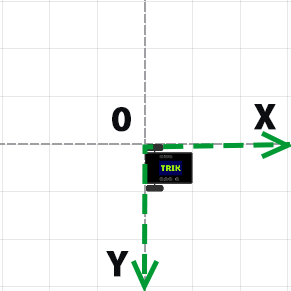
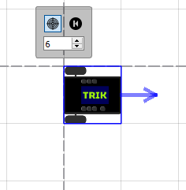
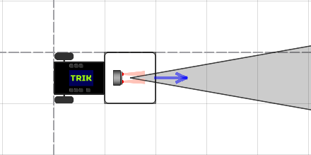
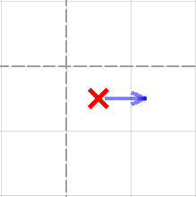
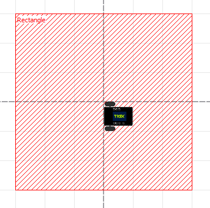
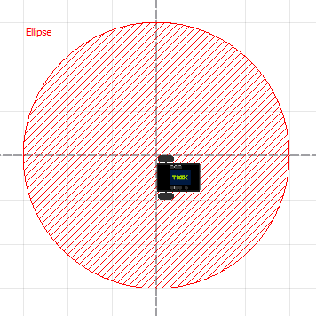

# 2D model tuning

Defines walls. Used as a container, has no attributes. In addition to creating a [virtual world](./#editor-world) of robots in TRIK Studio, you can do more flexible customization by editing an XML file: specify the location of objects, color, width, and other parameters more precisely.

First, you need to [create](settings.md#create-xml) an XML file for the virtual model.

## 2D model coordinate system

In the 2D model window the axes located as follows:




**Attention!** One cell has dimensions of 17.5 × 17.5 centimeters or 50 × 50 pixels.


## An XML file creation <a href="#create-xml" id="create-xml"></a>

To create an empty XML file you should use your OS' standard tools such as Notepad in Windows or whatever.

To save the world model created in TRIK Studio:

1. Switch to the [2D model](./) mode.
2. Go to the ["Debug mode"](../interface/#mode-debug).
3. Right-click on the scene and choose "Save world model..." in the context menu.\
   &#x20;&#x20;
4. Specify the location and file name to save.

## Editing an XML file <a href="#editor-xml" id="editor-xml"></a>

Open a saved XML file in a text editor. [Notepad++](https://notepad-plus-plus.org), for example.

The XML file contains tags and attributes.

### Tags

Tag is a markup language element. There is the start (opening) and end (closing) tags. The text contained between the start and end tags is displayed and placed according to the properties specified in the start tag.

Example:

```markup
<walls> <!-- start (opening) tag -->
     <wall begin="200:-200" id="{a3ede76b-1d7e-4c72-9ed4-08d8ea9af4bf}" end="200:150"/>
</walls> <!-- end (closing) tag -->
```

### **Attributes**

Attributes are tag properties that provide additional text formatting capabilities. They are recorded as a combination of "attribute name-value". Text values are enclosed in quotation marks.

In the above example, the attributes are:

`begin="200:-200"`\
`id="{a3ede76b-1d7e-4c72-9ed4-08d8ea9af4bf}"`\
`end="200:150"`

The simplest virtual world model without objects in `.xml` the format is as follows:


```markup
<?xml version='1.0' encoding='utf-8'?>
<root>
    <world>
        <background/>
        <walls/>
        <skittles/>
        <balls/>
        <colorFields/>
        <images/>
        <regions/>
    </world>
    <robots>
        <robot direction="0" id="trikKitRobot" position="0:0">
            <sensors/>
            <startPosition direction="0" id="{name}" y="25" x="25"/>
            <wheels left="M4###output###М4###" right="M3###output###М3###"/>
        </robot>
    </robots>
</root>
```


## Robots <a href="#robots" id="robots"></a>

The following tags are available for describing robots:

| Tag                                                        | Description                                                                                              |
| ---------------------------------------------------------- | -------------------------------------------------------------------------------------------------------- |
| ****[**robots**](settings.md#tag-robots)****               | Defines a robot on stage. Used as a container and must contain a [robot](settings.md#tag-robot) element. |
| ****[**robot**](settings.md#tag-robot)****                 | Adds a robot to the scene. Can be used as a container.                                                   |
| ****[**sensors**](settings.md#tag-sensors)****             | Defines sensors on a robot. Used as a container.                                                         |
| ****[**sensor**](settings.md#tag-sensor)****               | Sensors ports configuration.                                                                             |
| ****[**startPosition**](settings.md#tag-startposition)**** | Defines the starting position of the robot.                                                              |
| ****[**wheels**](settings.md#tag-wheels)****               | Motor ports configuration.                                                                               |


### \<robots>...\</robots> <a href="#tag-robots" id="tag-robots"></a>

Defines a robot on stage. Used as a container, has no attributes.

```markup
<robots>
     <robot id="trikKitRobot" position="0:0" direction="0">
</robots>
```


### \<robot>...\</robot> <a href="#tag-robot" id="tag-robot"></a>

Adds a robot to the scene. Can be used as a container.


**Attention!** You can not add multiple robots to the scene.


#### Attributes

| Attribute             | Description                                                                                                                                                                     |
| --------------------- | ------------------------------------------------------------------------------------------------------------------------------------------------------------------------------- |
| **direction="0″**     | The direction of the robot, which can be adjusted by clicking on the robot and pulling the arrow.                                                                               |
| **position="x:y"**    | The position of the robot, where x and y is the position of the upper left point of the square of the robot in the [coordinate system](settings.md#2d-model-coordinate-system). |
| **id="trikKitRobot"** | Unique ID.                                                                                                                                                                      |

#### Example:

```markup
<robot id="trikKitRobot" position="0:0" direction="0">
```




### \<sensors>...\</sensors> <a href="#tag-sensors" id="tag-sensors"></a>

Defines sensors on a robot. Used as a container, has no attributes.

```markup
<sensors>
     <sensor type="kitBase::robotModel::robotParts::Motor" direction="0" port="M4###output###JM4$$$D$$$4###" position="75:25"/>
</sensors>
```


### \<sensor/> <a href="#tag-sensor" id="tag-sensor"></a>

Sensors ports configuration.

#### Attributes

| Attribute                                              | Description                                                                                                                                                                   |
| ------------------------------------------------------ | ----------------------------------------------------------------------------------------------------------------------------------------------------------------------------- |
| **position="x:y"**                                     | The position of the sensor, where x and y is the position of the center point of the square of the sensor in the [coordinate system](settings.md#2d-model-coordinate-system). |
| **direction="0″**                                      | The direction of the sensor, which can be adjusted by clicking on the sensor and pulling the arrow.                                                                           |
| **port="A1###input######sensorA1"**                    | The port to which the sensor is connected.                                                                                                                                    |
| **type="trik::robotModel::parts::TrikInfraredSensor"** | Type of connected sensor.                                                                                                                                                     |

There are 5 types of sensors for TRIK and 9 types of sensors for EV3:



| Sensor                 | Description                |
| ---------------------- | -------------------------- |
| **TrikSonarSensor**    | Ultrasonic distance sensor |
| **TrikLineSensor**     | Line sensor.               |
| **TrikLightSensor**    | Light sensor.              |
| **TrikTouchSensor**    | Touch sensor.              |
| **TrikInfraredSensor** | Infrared distance sensor.  |



| Sensor                 | Description               |
| ---------------------- | ------------------------- |
| **RangeSensor**        | Range sensor.             |
| **TouchSensor**        | Touch sensor.             |
| **Ev3Gyroscope**       | Gyroscope.                |
| **LightSensor**        | Light sensor.             |
| **ColorSensorGreen**   | Color sensor (green).     |
| **ColorSensorFull**    | Color sensor (detection). |
| **ColorSensorBlue**    | Color sensor (blue).      |
| **ColorSensorRed**     | Color sensor (red).       |
| **ColorSensorPassive** | Color sensor (passive).   |



#### Example:

```markup
<sensor position="75:25" direction="0" port="A1###input###А1###sensorA1"
type="trik::robotModel::parts::TrikInfraredSensor"/>
```




### \<startPosition/> <a href="#tag-startposition" id="tag-startposition"></a>

Defines the starting position of the robot.

#### Attributes

| Attribute         | Description                                                                                                        |
| ----------------- | ------------------------------------------------------------------------------------------------------------------ |
| **id="{name}"**   | Unique ID.                                                                                                         |
| **direction="0″** | The direction of the robot, if you click on the "return" button. To adjust, click on the cross and pull the arrow. |
| **x="25″**        | The x-axis position in the [coordinate system](settings.md#2d-model-coordinate-system).                            |
| **y="25″**        | The y-axis position in the [coordinate system](settings.md#2d-model-coordinate-system).                            |

#### Example:

```markup
<startPosition id="{7a326d25-82f4-4eb4-9b42-1e75576f35a4}" direction="0" x="25" y="25"/>
```




### \<wheels/> <a href="#tag-wheels" id="tag-wheels"></a>

Motor ports configuration.

#### Attributes

| **Attribute**                   | Description                                      |
| ------------------------------- | ------------------------------------------------ |
| **left="M4###output###М4###"**  | The port to which the left engine is connected.  |
| **right="M3###output###М3###"** | The port to which the right engine is connected. |

#### Example:



```markup
<wheels left="M4###output###М4###" right="M3###output###М3###"/>
```



```markup
<wheels left="B###output###В###" right="C###output###С###"/>
```



## Objects

&#x20;The following tags are available for describing objects:

| Tag                                        | Description                                                                                                                                            |
| ------------------------------------------ | ------------------------------------------------------------------------------------------------------------------------------------------------------ |
| walls                                      | Defines walls. Used as a container, has no attributes.                                                                                                 |
| skittles                                   | Defines skittles. Used as a container, has no attributes.                                                                                              |
| balls                                      | Defines balls. Used as a container, has no attributes.                                                                                                 |
| colorFields                                | Defines the elements that you can draw (line, Bezier curve, rectangle, ellipse, elements drawn with a stylus). Used as a container, has no attributes. |
| images                                     | Specifies the inserted image. Used as a container, has no attributes.                                                                                  |
| regions                                    | Defines regions. Used as a container, has no attributes.                                                                                               |
| [wall](settings.md#tag-wall)               | Adds a wall.                                                                                                                                           |
| [skittle](settings.md#tag-skittle)         | Adds a skittle.                                                                                                                                        |
| [ball](settings.md#tag-ball)               | Adds a ball.                                                                                                                                           |
| [line](settings.md#tag-line)               | Adds a ball.                                                                                                                                           |
| [cubicBezier](settings.md#tag-cubicbezier) | Adds a Bezier curve.                                                                                                                                   |
| [rectangle](settings.md#tag-rectangle)     | Adds a rectangle.                                                                                                                                      |
| [ellipse](settings.md#tag-ellipse)         | Adds an ellipse.                                                                                                                                       |
| [stylus](settings.md#tag-stylus)           | Detects the stylus on the scene. Used as a container.                                                                                                  |
| [stylusLine](settings.md#tag-stylusline)   | Allows you to draw arbitrary shapes using the stylus.                                                                                                  |
| [region](settings.md#tag-region)           | Allows you to add regions to the scene.                                                                                                                |

###

### \<wall> <a href="#tag-wall" id="tag-wall"></a>

Adds a wall to the scene.

#### Attributes

| Attribute       | Description                                                                                                                                        |
| --------------- | -------------------------------------------------------------------------------------------------------------------------------------------------- |
| **id="{name}"** | Unique ID.                                                                                                                                         |
| **begin="x:y"** | The beginning of the wall, where x and y is the position of the starting point in the [coordinate system](settings.md#2d-model-coordinate-system). |
| **end="x:y"**   | The end of the wall, where x and y is the position of the starting point in the [coordinate system](settings.md#2d-model-coordinate-system).       |

#### Example:

```markup
<wall id="{wall1}" begin="50:-50" end="250:-50"/>
```


### \<skittle> <a href="#tag-skittle" id="tag-skittle"></a>

Adds a skittle to the scene.

#### Attributes

| Attribute         | Description                                                                                        |
| ----------------- | -------------------------------------------------------------------------------------------------- |
| **markerY="44″**  | The position on which the skittle will stand along the Y-axis if you click on the "return" button. |
| **markerX="220″** | The position on which the skittle will stand along the X-axis if you click on the "return" button. |
| **id="{name}"**   | Unique ID.                                                                                         |
| **y="44″**        | Y-axis position.                                                                                   |
| **x="220″**       | X-axis position.                                                                                   |

#### Example:

```markup
<skittle rotation="0" id="{skittle1}" markerY="44" startRotation="0" x="220" y="44"
markerX="220"/>
```


### \<ball> <a href="#tag-ball" id="tag-ball"></a>

Adds a ball to the scene.

#### Attributes

| Attribute         | Description                                                                                    |
| ----------------- | ---------------------------------------------------------------------------------------------- |
| **markerY="169″** | The position on which the ball will fall along the Y-axis if you click on the "return" button. |
| **markerX="-18″** | The position on which the ball will fall along the X-axis if you click on the "return" button. |
| **id="{name}"**   | Unique ID.                                                                                     |
| **y="169″**       | Y-axis position.                                                                               |
| **x="-18″**       | X-axis position.                                                                               |

#### Example:

```markup
<ball rotation="0" id="{ball1}" markerY="169" startRotation="0" x="-18" y="169" markerX="-18"/> 
```


### \<line> <a href="#tag-line" id="tag-line"></a>

Adds a line to the scene.

#### Attributes

| Attribute                  | Description                                                                                                                                                                                                 |
| -------------------------- | ----------------------------------------------------------------------------------------------------------------------------------------------------------------------------------------------------------- |
| **begin="x:y"**            | The beginning of the line, where x and y is the position of the starting point in the [coordinate system](settings.md#2d-model-coordinate-system).                                                          |
| **end="x:y"**              | At end of the line, where x and y is the position of the starting point in the [coordinate system](settings.md#2d-model-coordinate-system).                                                                 |
| **id="{name}"**            | Unique ID.                                                                                                                                                                                                  |
| **stroke-width="6″**       | Line width.                                                                                                                                                                                                 |
| **fill="#ff000000″**       | The line fills color.                                                                                                                                                                                       |
| **fill-style="none"**      | Fill style. In this case, this attribute does not make sense, because the line is always smooth.                                                                                                            |
| **stroke-style="solid"**   | <p>Line style. There are 5 styles:</p><ul><li>solid — solid;</li><li>dot — dotted line;</li><li>dash — dash line;</li><li>dashdot — dash-dot;</li><li>dashdotdot — dash-dot line with two points.</li></ul> |
| **stroke="#ff000000″**     | Line color.                                                                                                                                                                                                 |

#### Example:

```markup
<line stroke-width="6" fill-style="none" end="250:-50" id="{line1}" stroke-style="solid"
fill="#ff000000" stroke="#ff000000" begin="50:-50"/>
```


### \<cubicBezier> <a href="#tag-cubicbezier" id="tag-cubicbezier"></a>

Adds a Bezier curve.

#### Attributes

| Attribute                | Description                                                                                                                                                |
| ------------------------ | ---------------------------------------------------------------------------------------------------------------------------------------------------------- |
| **cp1="x:y"**            | Marker defining the curve bend.                                                                                                                            |
| **cp2="x:y"**            | Marker defining the curve bend.                                                                                                                            |
| **stroke-style="solid"** | Style of the Bezier curve. The styles of the Bezier curve are similar to the line styles.                                                                  |
| **begin="x:y"**          | The beginning of the Bezier curve, where x and y is the position of the starting point in the [coordinate system](settings.md#2d-model-coordinate-system). |
| **end="x:y"**            | The end of the Bezier curve, where x and y is the position of the starting point in the [coordinate system](settings.md#2d-model-coordinate-system).       |
| **id="{name}"**          | Unique ID.                                                                                                                                                 |
| **fill-style="none"**    | Fill style. In this case, this attribute does not make sense, because the line is always smooth.                                                           |
| **stroke-width="6″**     | The width of the Bezier curve.                                                                                                                             |
| **stroke="#ff000000″**   | Bezier curve fills color.                                                                                                                                  |
| **fill="#ff000000″**     | Bezier curve color.                                                                                                                                        |

#### Example:

```markup
<cubicBezier id="{cubicBezier1}" fill-style="none" stroke-width="6" end="-106.577:134.894"
begin="-112.95:-192.25" fill="#ff000000" cp1="-142.95:-192.25" cp2="17.0502:-192.25"
stroke="#ff000000" stroke-style="solid"/>
```


###

### \<rectangle> <a href="#tag-rectangle" id="tag-rectangle"></a>

Adds a rectangle.

#### Attributes

| Attribute                | Description                                                                                                                                             |
| ------------------------ | ------------------------------------------------------------------------------------------------------------------------------------------------------- |
| **stroke-style="solid"** | Style of the rectangle. The styles of the rectangle are similar to the line styles.                                                                     |
| **begin="x:y"**          | The beginning of the rectangle, where x and y is the position of the starting point in the [coordinate system](settings.md#2d-model-coordinate-system). |
| **end="x:y"**            | The end of the rectangle, where x and y is the position of the starting point in the [coordinate system](settings.md#2d-model-coordinate-system).       |
| **id="{name}"**          | Unique ID.                                                                                                                                              |
| **fill-style="none"**    | Fill style. The default value is "none". The filled rectangle should be set to "solid".                                                                 |
| **fill="#ff000000″**     | Border color.                                                                                                                                           |
| **stroke-width="6"**     | Border width.                                                                                                                                           |
| **stroke="#ff000000″**   | Fill color.                                                                                                                                             |

#### Example:

```markup
<rectangle stroke-width="6" fill-style="none" end="344:511" id="{rectengle1}" 
stroke-style="solid" fill="#ff000000" stroke="#ff000000" begin="285:229"/>
```


###

### \<ellipse> <a href="#tag-ellipse" id="tag-ellipse"></a>

Adds an ellipse.

#### Attributes

| Attribute                | Description                                                                                                                                           |
| ------------------------ | ----------------------------------------------------------------------------------------------------------------------------------------------------- |
| **stroke-style="solid"** | Style of the ellipse. The styles of the rectangle are similar to the line styles.                                                                     |
| **begin="x:y"**          | The beginning of the ellipse, where x and y is the position of the starting point in the [coordinate system](settings.md#2d-model-coordinate-system). |
| **end="x:y"**            | The end of the ellipse, where x and y is the position of the starting point in the [coordinate system](settings.md#2d-model-coordinate-system).       |
| **id="{name}"**          | Unique ID.                                                                                                                                            |
| **fill-style="none"**    | Fill style. The default value is "none". The filled ellipse should be set to "solid".                                                                 |
| **stroke-width="6″**     | Border width.                                                                                                                                         |
| **fill="#ff000000″**     | Border color.                                                                                                                                         |
| **stroke="#ff000000″**   | Fill color.                                                                                                                                           |

#### Example:

```markup
<ellipse stroke-width="6" fill-style="none" end="-178:300" id="{ellipse1}" 
stroke-style="solid" fill="#ff000000" stroke="#ff000000" begin="-260:7"/>
```


###

### \<stylus> <a href="#tag-stylus" id="tag-stylus"></a>

Defines a stylus for drawing.

#### Attributes

| Attribute                | Description                                                                                                              |
| ------------------------ | ------------------------------------------------------------------------------------------------------------------------ |
| **stroke-style="solid"** | Style of the stylus. The styles of the stylus are similar to the line styles.                                            |
| **id="{name}"**          | Unique ID.                                                                                                               |
| **fill-style="none"**    | Fill style. In this case, this attribute does not make sense, because shapes drawn with a stylus are always homogeneous. |
| **stroke-width="6″**     | Stilus width.                                                                                                            |
| **fill="#ff000000″**     | Stylus color.                                                                                                            |
| **stroke="#ff000000″**   | Fill color.                                                                                                              |

#### Example:

```markup
<stylus stroke-width="6" fill-style="none" id="{stylus_name}" stroke-style="solid" 
fill="#ff000000" stroke="#ff000000">
```


### \<stylusLine> <a href="#tag-stylusline" id="tag-stylusline"></a>

Allows you to draw arbitrary shapes using the stylus. This block of code consists of many segments.

#### Attributes

| Attribute                | Description                                                                                                              |
| ------------------------ | ------------------------------------------------------------------------------------------------------------------------ |
| **stroke-style="solid"** | Shape style. The styles of the shape are similar to the line styles.                                                     |
| **id="{name}"**          | Unique ID.                                                                                                               |
| **fill-style="none"**    | Fill style. In this case, this attribute does not make sense, because shapes drawn with a stylus are always homogeneous. |
| **stroke-width="6″**     | Stilus width.                                                                                                            |
| **fill="#ff000000″**     | Stylus color.                                                                                                            |
| **stroke="#ff000000″**   | Fill color.                                                                                                              |

#### Example:

```markup
<stylusLine stroke-width="6" fill-style="none" end="-334:259" id="{name1}" stroke-style="solid"
fill="#ff000000" stroke="#ff000000" begin="-334:260"/>
<stylusLine stroke-width="6" fill-style="none" end="-333:258" id="{name2}" stroke-style="solid"
fill="#ff000000" stroke="#ff000000" begin="-334:259"/>
<stylusLine stroke-width="6" fill-style="none" end="-333:254" id="{name3}" stroke-style="solid"
fill="#ff000000" stroke="#ff000000" begin="-333:258"/>
```

&#x20;


### \<region> <a href="#tag-region" id="tag-region"></a>

Allows you to add regions to the scene. There are 2 types of regions:

* rectangle



* ellipse



#### Attributes

| **Attribute**        | Description                                                                                                                                                                                                             |
| -------------------- | ----------------------------------------------------------------------------------------------------------------------------------------------------------------------------------------------------------------------- |
| **filled="true"**    | Fill. The default value is true.                                                                                                                                                                                        |
| **type="rectangle"** | Region type.                                                                                                                                                                                                            |
| **height="300″**     | The height of the region (in the case of an ellipse, this is the height of the rectangle that describes the ellipse).                                                                                                   |
| **width="300″**      | The width of the region (in the case of an ellipse, this is the width of the rectangle that describes the ellipse).                                                                                                     |
| **text="Finish"**    | The text will be displayed in TRIK Studio.                                                                                                                                                                              |
| **textX="0″**        | The position is of the text relative to the lower-left corner along the X-axis.                                                                                                                                         |
| **textY="0″**        | The position is of the text relative to the lower-left corner along the Y-axis.                                                                                                                                         |
| **x="1300″**         | The position of the beginning of the region (upper left corner) along the X-axis (in the case of an ellipse, this is the coordinate along the X-axis of the upper left corner of the rectangle describing the ellipse). |
| **y="-200″**         | The position of the beginning of the region (upper left corner) along the Y-axis (in the case of an ellipse, this is the coordinate along the Y-axis of the upper left corner of the rectangle describing the ellipse). |
| **visible="false"**  | Visibility in TRIK Studio.                                                                                                                                                                                              |
| **id="finish"**      | Unique ID.                                                                                                                                                                                                              |
| **color="#ff0000″**  | Fill and borders color.                                                                                                                                                                                                 |

#### Example:

```markup
<regions>
            <region filled="true" type="rectangle" height="300" width="300" textX="0" 
text="Finish" textY="0" x="1300" y="-200" visible="true" id="Start" color="#ff0000"/>
</regions>
```


## 2D model setup example

### The "Barcode" task

You need to draw a barcode. The barcode consists of white and black lines of the same thickness. The black line specifies 1 in a binary number, and the white one 0. The first black line in the robot path is the first bit of the number.

The barcode lines order: `1001011011`.

### World creation

In this task, the lines should be the same thickness and length. It’s very difficult to draw lines by hand using the Line or Stylus tool, so edit the lines manually:

1\. Draw 10 lines on the scene.


2\. Save the model of the world.

.png>)

3\. Open the resulting XML file in any convenient editor. Pay attention to the code block with the`<line...>`tag.


4\. For convenience, name each line black1-black5 and white1-white5. You can do this in the "id" attribute. Name the lines in the order shown above.


5\. Specify the line thickness "50" in the `stroke-width`attribute.


6\. Assign the color to each line: `#ff000000` is black, `#ffffffff` is white. You can do this in the attribute `fill`. Assign colors so that you get a barcode.


&#x20;7\. Set the position of each line in the `begin`and `end`attributes without gaps, so that you get a smooth barcode.


**The result**


