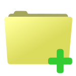
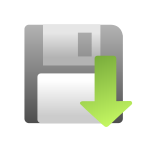
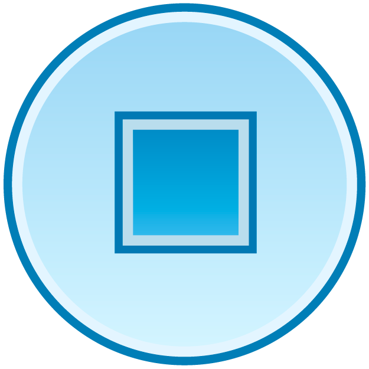
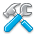
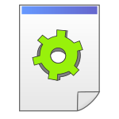
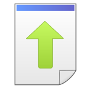

# TRIK Studio interface

## TRIK Studio modes

The TRIK Studio interface depends on the selected mode. TRIK Studio has two modes:

1. ****[**Editing mode**](./#mode-edit)\
   It is intended for creating a robot control diagram and executing it in the generation mode.\

2. ****[**Debug mode**](./#mode-debug)\
   It is intended for executing and debugging a program on a 2D model or in interpretation mode on a real robot.

### Switching between modes

There are three ways to switch modes:

1. Keyboard shortcuts `Ctrl+1` / `Ctrl+2`.
2. [Mode switching panel.](./#mode\_switching\_panel)
3. [Status bar](./#status-bar).

## Editing mode 

TRIK Studio in edit mode has the following interface elements:

* [Editor window/scene](./#editor-window)
* [Main menu](./#main-menu)
* [File panel](./#panel-file)
* [Edit panel](./#panel-edit)
* [View panel](./#panel-view)
* [Interpreter panel](./#panel-interpreter)
* [Generators panel](./#panel-generators)
* ["Others" panel](./#panel-other)
* [Panel for switching between editor and debug mode](./#mode\_switching\_panel)
* [Property editor panel](./#panel-property-editor)
* [Sensor settings](./#panel-configure-devices)
* [Palette (set of blocks for diagrams creation)](./#panel-palette)
* [Variables panel](./#panel-variables)
* [Status bar](./#status-bar)

### Editor window/scene 

The scene displays the diagram and allows you to edit it.

Read about creating a new project and working with the diagrams in the articles:


[start.md](../start.md)



[blocks-add-delete.md](../programming-visual/blocks-add-delete.md)


Editor mode also displays the current executable block when interpreting diagrams.

## Main menu

The main menu of TRIK Studio contains a set of basic operations and environment settings:

* [File](main-menu.md#menu-file)
* [Edit](main-menu.md#menu-edit)
* [View](main-menu.md#menu-view)
* [Tools](main-menu.md#menu-tools)
* [Settings](main-menu.md#menu-settings)
* [Help](main-menu.md#menu-about)

For more information, see the article:


[main-menu.md](main-menu.md)


### File panel 

The "File" panel repeats the main operations available from the "[File](main-menu.md#menu-file)" menu.

&#x20; Create a new project.\
&#x20; Open a saved project.\
&#x20; Save the current project.

### Edit panel 

 Cancel the operation.\
&#x20;Repeat the operation.

### View panel 

The View panel contains buttons that allow you to scale diagrams.

Zoom in / out.

You can also zoom the scene using:

1. Hold down the `Ctrl` key and roll the mouse wheel.
2. Keyboard shortcut `Ctrl+=` и `Ctrl+-`.

### Interpreter panel 

The Interpreter panel contains the commands for starting and stopping the execution of a program, buttons for switching interpretation modes between a two-dimensional model and a real robot, as well as a button for opening [robot settings](../settings.md#robots) available from the Tools menu.

When working with a real robot in interpretation mode, this panel also contains a "Connect" button.

 Run program.\
 Stop program.\
 2D model mode.\
 Real robot mode.\
 Robot settings.

### Generators panel 


The commands in this panel change depending on the program configuration.


The Generators panel contains commands for generating code and loading the program to the robot.

 Generate code.\
 Upload program to the robot.

### "Other" panel 

"Other" panel may contain various information depending on the chosen platform.

For example, for the [TRIK kit](../../trik/about/) this panel displays the IP address of the controller to which you are connecting.

### Panel for switching between editing and debugging modes 

The panel for mode switching displays the current TRIK Studio mode and allows you to switch between editing and debugging modes.

 Editor.\
 Debug.

### Property editor panel 

The property editor is used to display and edit the property values ​​of selected objects (blocks, links).&#x20;

About working with the property editor see article:


[editing-element-properties.md](../programming-visual/editing-element-properties.md)


### Sensors settings panel 

Sensor settings allow you to specify which sensors are used on which port. The same can be done from the robot settings dialog.


Available set of sensors depends on the selected platform in the settings on the [Robots](../settings.md#robots) tab.


### Palette panel 

The Palette panel contains a set of available blocks and the relationships between them, which can be added to the diagram.


1. The composition of the palette may vary depending on the platform selected in the [settings](../settings.md#robots).
2. Blocks that are not available in the selected execution model (2D model or on a real robot) are highlighted in gray.


How to add and remove blocks to the scene in TRIK Studio read in the article:


[blocks-add-delete.md](../programming-visual/blocks-add-delete.md)


### Variables panel 

Displays the list of variables used when executing the diagram with their current values, including [sensor variables](../programming-visual/expression-syntax/sensory-variables.md). When executed in the interpretation mode on a two-dimensional model or a real robot, they are taken from the robot in real-time. Not used in the generation mode.

### Status bar 

The status bar displays the current TRIK Studio mode ([editing](./#mode-edit) or [debugging](./#mode-debug)) and allows you to switch between modes. To switch between them, just click on the status bar.

## Debug mode 

The elements of the TRIK Studio interface in debug mode repeat the elements in edit mode, except for the editor window, property editor panels and palette. Instead of these elements, the next elements are displayed:

* [2D model window](./#window-2-d-1)
* [Error panel](./#window-error)
* [Robot settings panel](./#panel-settings-robot)
* [Plots panel](./#panel-graphics)

### 2D model window 

The 2D model window opens if a 2D model is selected as the program execution mode.

The window allows you to set the environment in which the robot will be executed, set the robot sensors and observe how the program written in edit mode will work.

Read more about the 2D model in the article:


[2d-model](../2d-model/)



In the Interpretation and Generation modes for the real robot, this window is not displayed, an executable diagram is displayed instead.


### Robot settings panel 

The robot settings panel displays the type of controller and robot parameters that depend on the selected [platform](../about/#platforms).

#### Opening robot settings panel

### Error panel 

In the case of syntactic and semantic errors in the TRIK Studio, a window with the corresponding messages appears.

To view the block where the error occurred, click on the message.

### Plots panel 

The Plots window displays the values sent by the sensors in real-time.

Read more in the article:


[graphics.md](graphics.md)

