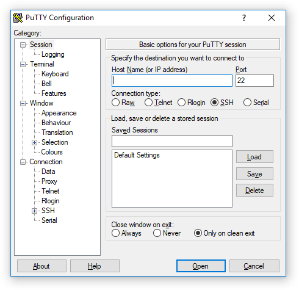
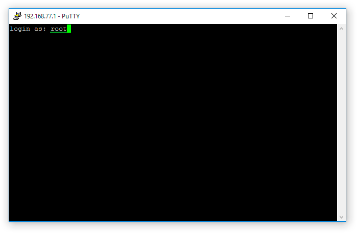

# PuTTY

**PuTTY** — a client program for working with network protocols. You can connect to the [TRIK controller](../../trik/about/) using the SSH and Serial protocols.

## Launching PuTTY from TRIK Studio

To run PuTTY, go to `Tools → External tools → PuTTY`.

## Connection to the TRIK controller in PuTTY

1\. Connect the controller to the computer via [Wi-Fi](../../trik/wi-fi/network-connection.md).

2\. In the TRIK Studio settings on the [Robots](../settings.md#robots) tab, write down the IP address of the controller, which is displayed on the main screen of the controller.

3\. Launch PuTTY from TRIK Studio by selecting `Tools → External tools → PuTTY` from the main menu.

4\. In the window that opens, enter the `root` login. Leave the `Password` field blank.

