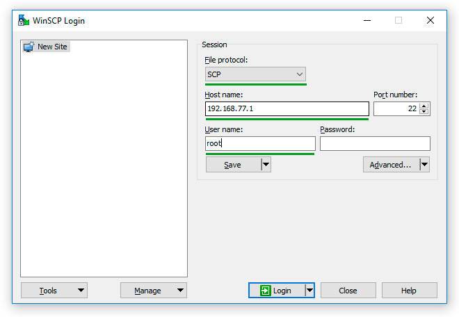
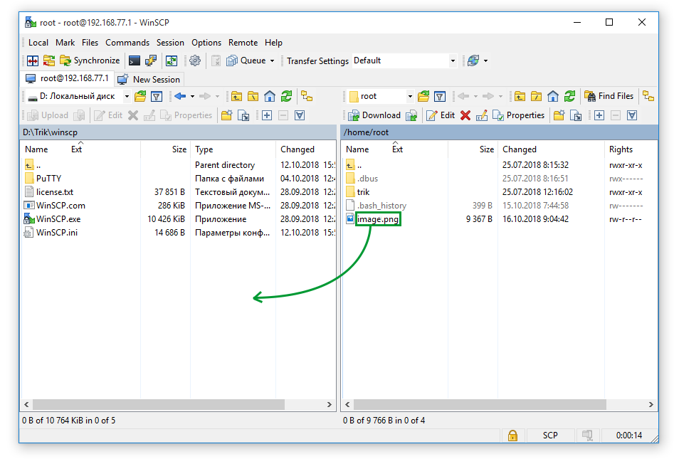

# WinSCP

**WinSCP** — an **SFTP** and **SCP** protocol graphical client for Windows. Using it, you can exchange files between the TRIK controller and the computer using the **SCP** protocol.

## Run WinSCP from TRIK Studio

To start the utility go to the menu `Tools → External tools → WinSCP`.

## Connect to the TRIK controller in WinSCP

1\. In the directory with TRIK Studio installed, go to the `winscp` folder and run `WinSCP.exe.`

2\. **** Fill in the next fields:

* **File protocol:** SCP
* **Host name:** [controller IP address](../../trik/wi-fi/network-connection.md#accesspoint).
* **User name:** root.

Leave the `Password` field blank.

3\. Press the "Login" button.

4\. If "Warning" window is opened, press «Yes».


This warning occurs when **WinSCP** connects to a new **SSH** server.


5\. On the left side of the application, the file system of your computer will be, on the right - the file system of the TRIK controller.

