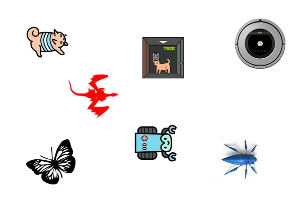
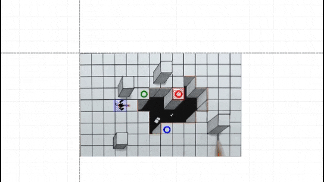
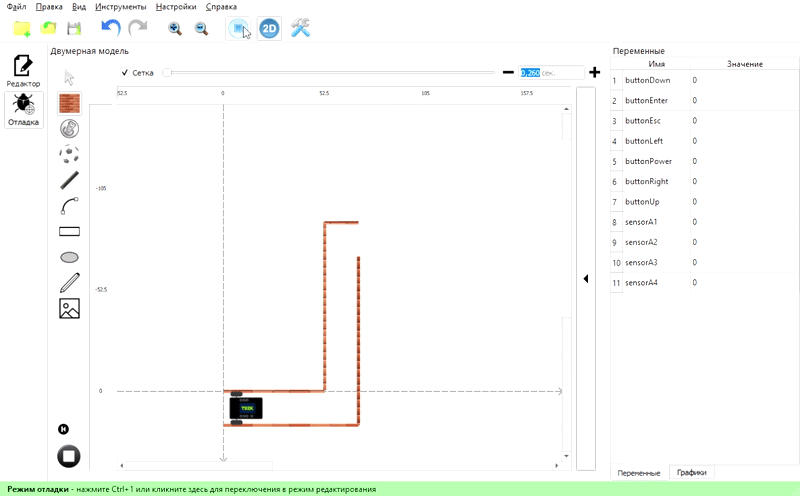

# About TRIK Studio Junior


This article is automatically translated from Russian by Google Translator.


**TRIK Studio Junior** is a free programming environment with the ["Character movement"](./#character-movement) for elementary grades.

The environment has a common interface with the [TRIK Studio](../../studio/about/) programming environment for robots, which allows for a continuous learning process, starting from elementary grades.

## Features of TRIK Studio Junior 

1\. Loops, subprograms, arrays, mathematical and logical operators support.


[blocks.md](../visual-programming/blocks.md)


2\. Wide range of characters.


[robot-image-change.md](../interface/robot-image-change.md)


3\. Support for exercise creation with auto-check for self-study and homework.


[exercises.md](../exercises.md)


4\. Just like TRIK Studio, TRIK Studio Junior has an [interactive simulation mode](../../studio/2d-model/). You don't need to have a constructor to learn how to program.


Since the interface and work in TRIK Studio Junior in many respects coincides with the interface and work in TRIK Studio, some articles in this section will provide links to similar articles in the TRIK Studio help section.


## What is "Character movement" 

"Character movement" — an object that understands and executes the commands of the algorithm. In TRIK Studio Junior, you can change the artist's image.


[robot-image-change.md](../interface/robot-image-change.md)


## Download TRIK Studio Junior 

You can download the latest version of TRIK Studio on the website [trikset.com](https://trikset.com/en/downloads#trikstudiojr).


[version.md](version.md)


## Recommended system requirements

* RAM: 4 GB or more.
* Operating system:
  * 64-bit Microsoft Ⓡ Windows 10.
  * Ubuntu 16.04 and later.
  * macOS 10.12 Sierra and later.
