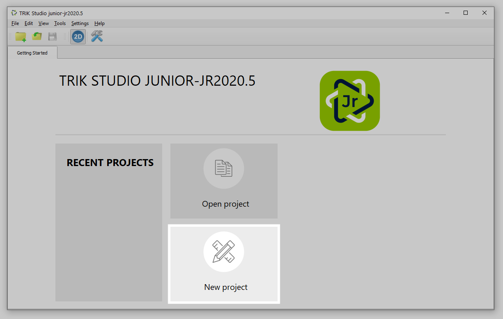
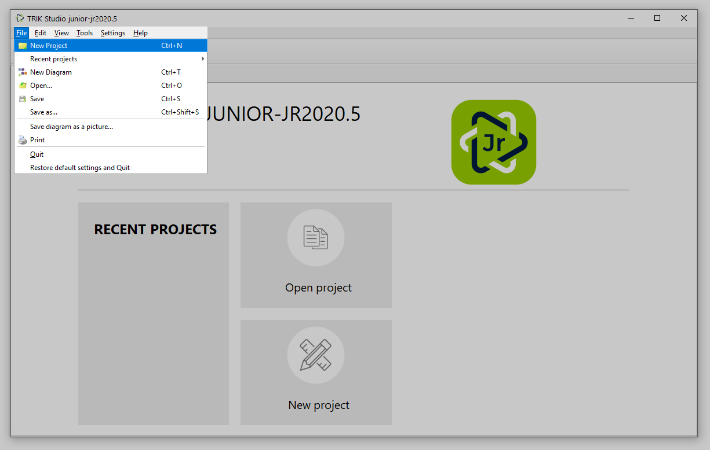
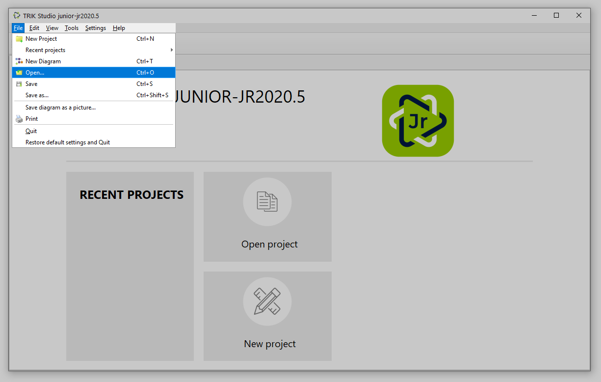

# Getting started and creating a project in TRIK Studio Junior

## Main window

After starting TRIK Studio Junior, you will see the start page that displays the [version](about/version.md) of TRIK Studio Junior, quick access to recent projects, and buttons for [opening an existing project](start.md#launch-an-existing-project) and [creating a new one](start.md#project-creation).

.png>)

## Project creation

To create a new project, click the "New project" button on the TRIK Studio Junior home page.

Or select `File → New project` from the [main menu](../studio/interface/main-menu.md).&#x20;

A window opens with a new program in the visual programming language:

.png>)

Read about programming in a visual language in the article:

## Launch an existing project

To start an existing project, click the "Open project" button on the TRIK Studio start page.

.png>)

Or in the [main menu](../studio/interface/main-menu.md), select `File → Open...`.&#x20;

By default, TRIK Studio Junior searches for files in the `*.tsj` __ format.
