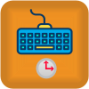

# Blocks in TRIK Studio Junior


This article is automatically translated from Russian by Google Translator.


TRIK Studio Junior blocks consist of four categories:

1. [Algorithms](blocks.md#algorithms) — blocks to describe algorithms.
2. [Actions](blocks.md#actions) — blocks that perform any action on the "Character movement": commands to drive forward, turn, play sound, and others.
3. [Waiting](blocks.md#waiting) — blocks waiting for an event to occur: certain sensor readings, pressing a button, etc.
4. [Drawing](blocks.md#drawing) — blocks displaying graphics and text on the screen.

## Algorithms 

|                                                                                              Icon                                                                                             |                        Name                       | Description                                                                                                                                                                                                                                                                                        |
| :-------------------------------------------------------------------------------------------------------------------------------------------------------------------------------------------: | :-----------------------------------------------: | -------------------------------------------------------------------------------------------------------------------------------------------------------------------------------------------------------------------------------------------------------------------------------------------------- |
|   |         [Initial Node](blocks.md#initial)         | 
The starting point for program execution.

Each diagram should have only one such block. There should not be any incoming links in it, and there should be only one outgoing link from this element.

The process of diagram interpretation begins with this block.
 |
|                                                                                                                |           [Final Node](blocks.md#final)           | 
End of the program.

If the program consists of several parallel execution sections, reaching this block completes the corresponding execution section.

This block cannot have outgoing links.
                                                                     |
|                                                                                                    | [Variable Initialization](blocks.md#variableinit) | A block for declaring a new variable and setting a value for it.                                                                                                                                                                                                                                   |
|                                                                                                               |          [Condition](blocks.md#condition)         | 
Separation of program execution in accordance with a given condition.

                                                                                                                                                                                                                |
|                                                                                                                |             [End if](blocks.md#endif)             | Indicates merging of two branches of a conditional statement. It does not perform any actions but is useful for ensuring the structure of the program.                                                                                                                                             |
|                                                                                                  |      [Pre-conditional loop](blocks.md#while)      | A loop that is executing so far some condition is true, indicated before it begins. This condition is checked before the loop body is executed, so the body may not be satisfied even once (if the condition is false from the very beginning).                                                    |
|                                                                                                                 |               [Loop](blocks.md#loop)              | Block that provides the execution of a sequence of blocks several times.                                                                                                                                                                                                                           |
|                                                                                                               |             [Switch](blocks.md#switch)            | A condition with several alternatives.                                                                                                                                                                                                                                                             |
|                                                                                                             |         [Expression](blocks.md#expression)        | Counts the value of the specified expression. Initialization of variables is also allowed.                                                                                                                                                                                                         |
|                                                                                                      |         [Subprogram](blocks.md#subprogram)        | Subprogram execution.                                                                                                                                                                                                                                                                              |
|                                                                                                                 |               [Fork](blocks.md#fork)              | 
Block divides program execution into several threads.

                                                                                                                                                                                                                                |
|                                                                                                              |               [Join](blocks.md#join)              | Block merging parallel tasks.                                                                                                                                                                                                                                                                      |
|                                                                                                           |        [Kill thread](blocks.md#killthread)        | Finishes the task with the identifier specified in the "Task" property. Must be applied from another task.                                                                                                                                                                                         |
|                                                                                                           |     [Random Initialization](blocks.md#random)     | A block for assigning a specified variable to a random integer from a given interval.                                                                                                                                                                                                              |
|                                                                                                             |            [Comment](blocks.md#comment)           | Block for adding arbitrary text to the diagram as a comment.                                                                                                                                                                                                                                       |

### Initial Node

The starting point for program execution.

Each diagram should have only one such block. There should not be any incoming links in it, and there should be only one outgoing link from this element.

The process of diagram interpretation begins with this block.

### Final Node

.png>)

End of the program.

If the program consists of several parallel execution sections, reaching this block completes the corresponding execution section.

This block cannot have outgoing links.

### Variable Initialization

A block for declaring a new variable and setting a value for it. The same operation can be performed using the [Expression](blocks.md#expression) block, but this block makes the program more clear.

#### Properties

| Property     | Description                                                                |
| ------------ | -------------------------------------------------------------------------- |
| **Value**    | An expression is specified that defines the initial value of the variable. |
| **Variable** | The variable name is specified.                                            |

### Condition

.png>)

Separation of program execution in accordance with a given condition.

This block must have two outgoing connections, at least one of which must have the value of the Condition parameter set: true or false.

#### Properties

| Property      | Description                                                                                                                                                                                                |
| ------------- | ---------------------------------------------------------------------------------------------------------------------------------------------------------------------------------------------------------- |
| **Condition** | A logical expression is indicated (for more details, see the article "[Expression Syntax](expression-syntax.md)"), based on the value of which the further path of the diagram execution will be selected. |

### End if

.png>)

Indicates merging of two branches of a conditional statement. It does not perform any actions but is useful for ensuring the structure of the program.\
\
It does not perform any actions but is useful for ensuring the structure of the program. If you adhere to the rule that all branches of the "[Condition](blocks.md#condition)" or "[Switch](blocks.md#switch)" operators converge on such a block, this will significantly increase the chances that the generator will be able to generate code in text language without `goto` statements.

### Pre-conditional Loop

.png>)

A loop with a precondition is a loop that is true so far for some conditions specified before it starts. This condition is checked before the loop body is executed, so the body may not be satisfied even once (if the condition is false from the very beginning).

#### Properties

| Property      | Description                                                                                                                                                                                                            |
| ------------- | ---------------------------------------------------------------------------------------------------------------------------------------------------------------------------------------------------------------------- |
| **Condition** | The logical expression is specified (for more details, see the article "[Syntax of expressions](expression-syntax.md)"), based on the value of which the further path of the diagram interpretation will be selected.  |

### Loop

Block that provides the execution of a sequence of blocks several times.\
\
The number of repetitions is set by the value of the Iteration parameter. The block must have two outgoing connections, one of which must be marked with the value “body” (that is, the value of the “Condition” parameter the connection must have “body”). Another connection coming from the “Cycle” block should remain unmarked: it will go through when the program passes through the “Loop” block the specified number of times.\
\
Infinite loops and loops of the form `while / do` and `while` are organized without using this block, looping the control flow using links. An exit from such a loop is carried out using the “Condition” block.

### Switch

A condition with several alternatives.

In the "Expression" parameter, you can specify an arbitrary expression (for more details, see the section "[Syntax of expressions](expression-syntax.md)"), based on the value of which the further path of the diagram interpretation will be selected.

This block must have several outgoing links. All relations, except one, should be marked with an elementary value (string, number, etc.), which can take an expression (the value is simply written in the Condition property of the connection). One of the links should not be marked: it jumps if the expression is not equal to any of the listed values.

### Expression

.png>)

Evaluate the value of the specified expression. Initialization of variables is also allowed.

For more information about the syntax of valid expressions for the Expression parameter, see the section "[Expression syntax](expression-syntax.md)".

### Subprogram

Subprogram execution.\
\
Subprograms are used to keep repeating program fragments on a separate diagram.\
\
When adding this block to the diagram, you will be prompted to enter the name of the subprogram, after which double-clicking on the block will be able to go to the diagram corresponding to this subprogram. An additional palette with all the subprograms will also appear. Subprograms from it can be dragged onto the scene and used as normal blocks.\
\
The appearance, name, and properties of the block can be changed using the context menu.

#### Properties

Changing the properties of this block does not perform in the "Properties Editor" panel, but using the "Change Properties" item in the context menu. To call the context menu, right-click on the block "Subprogram".

.png>)

In the window that opens, you can:

* Change subprogram name.
* Add and change subprogram parameters by specifying a name, type, and value.
* Change the picture on the icon of your subprogram.
* Change subprogram icon background.

### Fork

A block divides program execution into several threads. For example, you can simultaneously wait for the sensor to trigger and the time interval to expire.\
\
A block must have at least two outgoing connections.\
\
In order to be able to further refer to parallel tasks generated by this block (for example, in the "[Kill thread](blocks.md#killthread)" block or in the "[Join](blocks.md#join)" block), you need to give the names of the tasks. This is done on outgoing connections, in the Condition property. The name of the task can be any string, but one of the names should be the name of the task that is included in this block. The name of the main program is `main`.

### Join

Block for merging parallel tasks.

It blocks the execution of the program until the execution of all parallel tasks included in this block reaches this block.

A block must have at least two incoming links. On the outgoing connection (in the “Condition” property) there must be an identifier for the task, which will continue after the block has completed.

### Kill thread

Finishes the task with the identifier specified in the "Task" property. Must be applied from another task.

### Random Initialization

A block for assigning a specified variable to a random integer from a specified interval using the From and To properties.

### Comment

Block for adding arbitrary text to the diagram as a comment.

Used to explain a specific block or section of a diagram. May be associated with the block, which he explains.

When the program is executed, the block is not taken into account.

## Actions 

|                                              Icon                                              |                            Name                            | Description                                                                  |
| :--------------------------------------------------------------------------------------------: | :--------------------------------------------------------: | ---------------------------------------------------------------------------- |
|   | [Send Message To Thread](blocks.md#send-message-to-thread) | Sends the message to the parallel thread with the identifier given.          |
|            |        [Get Button Code](blocks.md#get-button-code)        | Saves the code of the button pressed on the robot to the specified variable. |
|    |                [Forward](blocks.md#forward)                | Moves the "Character movement" forward by the specified number of cells.     |
|   |               [Backward](blocks.md#backward)               | Moves the "Character movement" back by the specified number of cells.        |
|         |             [Turn right](blocks.md#turn-right)             | Turns "Character movement" to the right.                                     |
|          |              [Turn left](blocks.md#turn-left)              | Turns "Character movement" to the left.                                      |
|                      |                    [Say](blocks.md#say)                    | Speak through the speaker the phrase passed as an argument.                  |
|                  |                    [LED](blocks.md#led)                    | Set the specified controller's LED color.                                    |

### Send Message To Thread

.png>)

Sends the message to a parallel task with a specified identifier (the identifier must be specified while creating the task in the "Fork" block).

The message can be arbitrary.

### Get Button Code

.png>)

Assigns the pressed button code to a specified variable.

The "Waiting" property allows you to wait for the button to be pressed. If the button is not pressed, the variable will be set to -1.

### Forward

.png>)

Moves the "Character movement" forward by the specified number of cells.

The "Number of cells" property allows you to set the number of cells the "Character movement" should move by.

### Backward

Moves the "Character movement" back by the specified number of cells.\
\
The "Number of cells" property allows you to set the number of cells the "Character movement" should move by.

### Turn right

Turns "Character movement" to the right.

### Turn left

Turns "Character movement" to the right.

### Say 

.png>)

Use the speaker to say the phrase passed as the block argument.

### LED 

.png>)

Set the specified LED color on the controller.

## Waiting 

|                                                Icon                                               |                                 Name                                 | Description                                                                                |
| :-----------------------------------------------------------------------------------------------: | :------------------------------------------------------------------: | ------------------------------------------------------------------------------------------ |
|                    |                       [Timer](blocks.md#timer)                       | Block for setting the delay. The delay time is set in the Delay parameter in milliseconds. |
|   | [Receive Message From Thread](blocks.md#receive-message-from-thread) | Wait for a message from another parallel task.                                             |
|                      .png>)                     |                  [User input](blocks.md#user-input)                  | Wait for the user to enter a value.                                                        |
|          |             [Wait for Button](blocks.md#wait-for-button)             | Wait until the specified button on the robot is pressed.                                   |

### Timer

Block for setting the delay. The delay time is set in the Delay parameter in milliseconds.

### Receive Message From Thread 

.png>)

Wait for a message from another parallel task.

The message text will be assigned to the specified variable.

The "Wait for message" property allows you to specify what to do if the message queue is empty: wait for a new message to arrive or continue working by assigning an empty string to the variable.

The message is automatically converted to the same type as the receiver variable. For example, if you send a number as a string, it will be accepted as a number.

### User input

Wait for the user to enter a value. The value will be assigned to the specified variable.

#### Properties

The block has three properties:

| Property     | Description             |
| ------------ | ----------------------- |
| **Variable** | Variable name.          |
| **Default**  | Default variable value. |
| **Text**     | Text field description. |

**Example**

| **Block**                                                                                       | Execution                                                                                       |
| ----------------------------------------------------------------------------------------------- | ----------------------------------------------------------------------------------------------- |
|   |   |

### Wait for Button 

.png>)

Wait until the specified button on the robot is pressed.

## Drawing

|                                           Icon                                          |                      Name                      | Description                                                                                                                                                                                                                           |
| :-------------------------------------------------------------------------------------: | :--------------------------------------------: | ------------------------------------------------------------------------------------------------------------------------------------------------------------------------------------------------------------------------------------- |
|   |     [Clear Screen](blocks.md#clear-screen)     | Erase everything that is drawn on the screen.                                                                                                                                                                                         |
|     |      [Marker Down](blocks.md#marker-down)      | Start drawing with a marker of a given color on the floor. When the robot moves in a two-dimensional model, a colored line will remain behind it.                                                                                     |
|       |        [Marker up](blocks.md#marker-up)        | Finish drawing with a marker.                                                                                                                                                                                                         |
|     |      [Print Text](blocks.md#print-text-1)      | Print the specified string at the specified location on the robot's screen. The default value of the "Text" property is interpreted as a pure string, so it will be displayed that way.                                               |
|        |    [Painter Color](blocks.md#painter-color)    | Specify the color to draw simple graphical shapes on the robot's screen.                                                                                                                                                              |
|        |    [Painter Width](blocks.md#painter-width)    | Specify the line width used to draw simple graphical figures on the robot's screen.                                                                                                                                                   |
|     |       [Draw Pixel](blocks.md#draw-pixel)       | Draw a dot on the screen at the specified coordinates.                                                                                                                                                                                |
|      |        [Draw Line](blocks.md#draw-line)        | Draw a line segment on the screen. Segment ends are given as parameters to the block.                                                                                                                                                 |
|      |   [Draw Rectangle](blocks.md#draw-rectangle)   | Draw a rectangle on the screen. The coordinates of the upper left corner, the width, and the height of the rectangle are specified as parameters.                                                                                     |
|    |     [Draw Ellipse](blocks.md#draw-ellipse)     | Draw an ellipse inscribed in a given rectangle on the screen.                                                                                                                                                                         |
|           |         [Draw Arc](blocks.md#draw-arc)         | Draw an arc on the screen, given the coordinates of the rectangle in which it will be inscribed, and the angles (in degrees) of its beginning and end on the circle. If the beginning and the end coincide, the circle will be drawn. |
|             |            [Smile](blocks.md#smile)            | Draw a smiley face on the screen.                                                                                                                                                                                                     |
|          |        [Sad Smile](blocks.md#sad-smile)        | Draw a sad smiley face on the screen.                                                                                                                                                                                                 |
|     | [Background Color](blocks.md#background-color) | Set the screen background color.                                                                                                                                                                                                      |

### Clear Screen 

.png>)

Erase everything that is drawn on the screen.

### Marker Down

Start drawing with a marker of a given color on the floor. When the robot moves in a two-dimensional model, a colored line will remain behind it.

The block is available only in the two-dimensional model mode.

### Marker Up

Finish drawing with a marker.

The block is available only in the two-dimensional model mode.

### &#x20;

### Print Text

.png>)

Prints the specified string at the specified location on the robot's screen.&#x20;

#### Properties

| Property | Value                                                                              |
| -------- | ---------------------------------------------------------------------------------- |
| Evaluate | 
True — print the variable or expression value.

False — print as text.
 |
| Text     | Text or variable/expression to be printed.                                         |
| Redraw   | 
True — redraw the screen. False — do not redraw.
                         |
| X, Y     | The text beginning coordinates.                                                    |

#### How to print a text?

To print a text:

1. Put your text into the Text property.
2. Uncheck the Evaluate checkbox.

#### How to print a variable value?

To print a variable value:

1. Put the variable name into the Text property.
2. Check the Evaluate checkbox.

### Painter Color 

.png>)

Specify the color to draw simple graphical shapes on the robot's screen.

### Painter Width

.png>)

Specify the width of the line used to draw simple graphical figures on the robot's screen.

### Draw Pixel 

.png>)

Draw a dot on the screen at the specified coordinates.

### Draw Line 

.png>)

Draw a line segment on the screen. Segment ends are given as parameters to the block.

### Draw Rectangle 

.png>)

Draw a rectangle on the screen. The coordinates of the upper left corner, the width, and the height of the rectangle are specified as parameters.

### Draw Ellipse 

.png>)

Draw an ellipse inscribed in a given rectangle on the screen.

### Draw Arc 

.png>)

Draw an arc on the screen, given the coordinates of the rectangle in which it will be inscribed, and the angles (in degrees) of its beginning and end on the circle. If the beginning and the end coincide, the circle will be drawn.

### Smile 

.png>)

Draw a smiley face on the screen.

### Sad Smile 

.png>)

Draw a sad smiley face on the screen.

### Background Color 

.png>)

Sets the screen background color.
