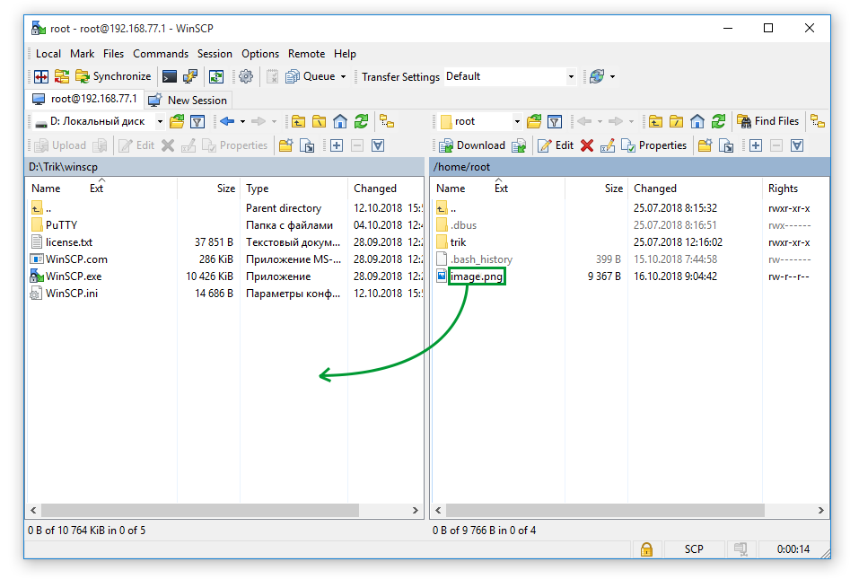

# Screenshot of the TRIK controller screen

A screenshot of the TRIK controller screen can be taken in two ways:

1. Using the [web interface](screenshot.md#using-the-web-interface).
2. With the [PuTTY and WinSCP utilities](screenshot.md#with-the-putty-and-winscp-utilities).

## Using the web interface

1\. Connect to the controller via Wi-Fi using any [method](../wi-fi/).

2\. Log in to the [web interface](../web-interface.md) by typing the IP address of the controller in the browser.

3\. Make sure that the image or text you want to take a screenshot of is displayed on the controller screen.

4\. Select the `Image` menu item in the web interface and click the `Make Screenshot` button.

5\. After that, the screenshot will appear in the list. If this does not happen, you need to refresh the page (F5 or Ctrl-R).

6\. To download the screenshots you've taken, click the `Download All` button.

## With the PuTTY and WinSCP utilities

1\. Connect to the controller via Wi-Fi using any [method](../wi-fi/).

2\.  Open TRIK Studio.

3\. Run the PuTTY utility. To do this, in the main menu open `Tools -> Third-Party Programs -> PuTTY`.

4\. Wait for the connection process to complete.

5\.  Make sure the controller displays the image or text you want to screenshot.

6\. Enter the `fbgrab image.png` command, where `image` is an arbitrary name for the saved image.

7\. If successful, the following text will be displayed in the console:

`Resolution: 240x320 depth 16`\
`Converting image from 16`\
`Now writing PNG file (compression -1)`

8\.  Run the [WinSCP](../../studio/utilities/winscp.md#run-winscp-from-trik-studio) utility. To do this, open `Tools → Third-Party Programs → WinSCP` in the main menu.&#x20;

9\. If you see a "Warning" window, click "Yes".

10\. Select in the left window the directory where you want to save the snapshot. Drag the created image from the right window to the left.

