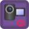
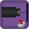
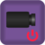
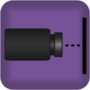
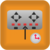
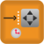
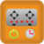
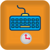
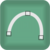

# TRIK specific blocks

TRIK specific blocks consist of three categories:

1. [Actions](blocks.md#action-blocks) - blocks that perform any action on the controller: turning on the motors, playing sounds, etc.
2. [Waiting](blocks.md#waiting-blocks) - blocks waiting for an event to occur: certain sensor readings, pressing a button, etc.
3. [Drawing](blocks.md#drawing-blocks) - blocks displaying graphics and text on the screen.

For blocks common for all platforms see the article


[blocks.md](../../studio/programming-visual/blocks.md)


## Action blocks

|                                               Icon                                               |                                 Name                                 | Description                                                                                                                                                                          |
| :----------------------------------------------------------------------------------------------: | :------------------------------------------------------------------: | ------------------------------------------------------------------------------------------------------------------------------------------------------------------------------------ |
|     |      [Send Message To Thread](blocks.md#send-message-to-thread)      | Sends the message to the parallel thread with the identifier given.                                                                                                                  |
|              |             [Get Button Code](blocks.md#get-button-code)             | Saves the code of the button pressed on the robot to the specified variable.                                                                                                         |
|                   |                   [Play Tone](blocks.md#play-sound)                  | Plays a sound with specified frequency and duration on the controller.                                                                                                               |
|               |                 [Play Sound](blocks.md#play-sound-1)                 | Play the specified sound file on the controller.                                                                                                                                     |
|         |              [Motors Forward](blocks.md#motors-forward)              | Turn on the motors at the specified ports with the specified power.                                                                                                                  |
|        |             [Motors Backward](blocks.md#motors-backward)             | Turn on the motors in reverse mode at the specified ports with the specified power.                                                                                                  |
|            |                 [Stop Motors](blocks.md#stop-motors)                 | Turn off the motors at the specified ports.                                                                                                                                          |
|   |               [Clear Encoder](blocks.md#clear-encoder)               | Reset the motors revolutions count for the specified ports.                                                                                                                          |
|               |               [Angular Servo](blocks.md#angular-servo)               | Set the servos rotation angle on the specified ports to the specified position.                                                                                                      |
|                        |                         [Say](blocks.md#say)                         | Speak through the speaker the phrase passed as an argument.                                                                                                                          |
|                    |                         [LED](blocks.md#led)                         | Set the specified controllers LED color.                                                                                                                                             |
|                 |                 [System Call](blocks.md#system-call)                 | The block has a logical parameter "Code". If it's True, the content of the "Command" parameter translates directly into the program code. Otherwise, an OS' CLI call will be pulled. |
|                 |         [Initialize Camera](blocks.md#initialize-videocamera)        | Turn on the video camera on the controller in one of the three modes.                                                                                                                |
|                 |                 [Stop Camera](blocks.md#stop-camera)                 | Turn off the camera.                                                                                                                                                                 |
|                 |           [Detect by Camera](blocks.md#detect-videocamera)           | Fixes the image in the center of the frame and initializes the line sensor or object sensor with it.                                                                                 |
|   | [Line Detector into Variable](blocks.md#line-detector-into-variable) | Places the current line sensor reading into the specified variable.                                                                                                                  |
|         |      [Enable Video Streaming](blocks.md#enable-video-streaming)      | Starts a video broadcast on the robot.                                                                                                                                               |
|         |     [Disable Video Streaming](blocks.md#disable-video-streaming)     | Stops the video feed from the robot's camera.                                                                                                                                        |
|            |                [Send message](blocks.md#send-message)                | Sends the message to the robot with the board number specified.                                                                                                                      |
|                |               [Write to File](blocks.md#write-to-file)               | Writes a given message to a file.                                                                                                                                                    |
|                 |                 [Remove File](blocks.md#remove-file)                 | Deletes a file.                                                                                                                                                                      |
|     |         [Calibrate Gyroscope](blocks.md#calibrate-gyroscope)         | Sets the gyroscope angle to zero at the current position.                                                                                                                            |

### Send Message To Thread

.png>)

Sends the message to a parallel task with a specified identifier (the identifier must be specified while creating the task in the "Fork" block).

The message can be arbitrary.

### Get Button Code

.png>)

Assigns the pressed button code to a specified variable.

The "Waiting" property allows you to wait for the button to be pressed. If the button is not pressed, the variable will be set to -1.

### Play Tone 

.png>)

Plays a sound with specified frequency and duration on the controller.

### Play Sound

.png>)

Plays an audio file on the controller.

The file must be pre-loaded on the controller. The path to the file is relative to the `trik` folder on the controller. You can download the file to the controller, for example, using the [WinSCP](../../studio/utilities/winscp.md) program.

### Motors Forward

.png>)

Turn on the motors on the given ports with the given power.

The ports are specified by lines M1, M2, M3, and M4, separated by commas. The power specified as a percentage by a number from -100 to 100. If the value is negative, the motors will be reversed.

### Motors Backward

.png>)

Turn on the motors in reverse mode on the given ports with the given power.

Parameters are similar to the "motors forward" block.

### Stop Motors 

.png>)

Stop the motors on the specified ports.

The ports are specified by lines M1, M2, M3, and M4, separated by commas.

### Clear Encoder

.png>)

Reset the motors revolutions count on the specified ports.

The ports are specified by lines E1, E2, E3, and E4, separated by commas.

### Angular Servo

.png>)

Set the servos rotation angle on the specified ports to the specified position (from -90 to 90 degrees).

The ports are specified by comma separated values.

### Say 

.png>)

Use the speaker to say the phrase passed as the block argument.

### LED 

.png>)

Set the specified LED color on the controller.

### System Call

.png>)

The block has a logical parameter "Code". If it's True, the content of the "Command" parameter translates directly into the program code. Otherwise, an OS' CLI call will be pulled.

### Initialize Camera 

.png>)

Enable the video camera on the controller in one of three modes:

1. **Line Sensor** - detects a color line in the center of the frame and subsequently returns the deviation of the center of the line from the center of the frame as a number in the range from -100 (left) to 100 (right).
2. **Object sensor** - detects a contrasting object in the center of the frame and later returns the coordinates of its center and diameter in pixels.
3. **Color sensor** - returns the dominant color in the center of the frame as its coordinates in the RGB color scale.

### Detect by Camera 

Captures the image in the center of the frame and initializes a line sensor or object sensor with it. The camera must be switched on in the appropriate mode with the "Initialize Camera" block.

### Line Detector into Variable 

.png>)

Places the current line sensor reading in the specified variable.

The camera must be switched on inline sensor mode by the "Initialize Camera" block and initialized by the "Detect by camera" block.

### Enable Video Streaming

Starts a video broadcast on the robot.

The video can be viewed on the TRIK control panel or in a browser at the address\
`{robots ip-address}:8080/?action=stream/`.

### Send message 

.png>)

Sends the message to the robot with the board number specified.

The robot must be on the same network as the robot sending the message and registered as master or slave using `Settings → Messages` on the robot. If there is more than one robot with the given board number in the network, all of them will receive the message.

### Write to File 

.png>)

Writes the given expression to a file.

The path can be absolute or relative to the folder containing `trik-studio.exe`.

The file can be retrieved from the controller, e.g. with the [WinSCP](../../studio/utilities/winscp.md) program for Windows or SCP for Linux.

### Remove File

.png>)

Deletes a file.\
\
The path can be absolute or relative to the folder containing `trik-studio.exe`.

### Stop Camera

.png>)

Turn off the camera.

### Disable Video Streaming

.png>)

Stop the video feed from the robot's camera.

### Calibrate Gyroscope

.png>)

Sets the gyroscope angle to zero at the current position..

## Waiting Blocks

| Icon                                                                                              |                                  Name                                  | Description                                                                                                                                    |
| ------------------------------------------------------------------------------------------------- | :--------------------------------------------------------------------: | ---------------------------------------------------------------------------------------------------------------------------------------------- |
|   |  [Receive Message From Thread](blocks.md#receive-message-from-thread)  | Wait for a message from another parallel task.                                                                                                 |
| .png>)                                          |                   [User input](blocks.md#user-input)                   | Wait for the user to enter a value.                                                                                                            |
|        |           [Wait for Gyroscope](blocks.md#wait-for-gyroscope)           | Wait until the value returned by the gyro sensor on the specified port is greater or less than the one specified in the "degrees" parameter.   |
|      |        [Wait for Touch Sensor](blocks.md#wait-for-touch-sensor)        | Wait for the touch sensor to operate on the specified port.                                                                                    |
|            |               [Wait for Light](blocks.md#wait-for-light)               | Wait until the value returned by the light sensor on the specified port is greater or less than the one specified in the "percents" parameter. |
|    | [Wait for Ultrasonic Distance](blocks.md#wait-for-ultrasonic-distance) | Wait until the distance returned by the ultrasonic distance sensor is greater or less than the one specified in the "distance" parameter..     |
|    |   [Wait for Infrared Distance](blocks.md#wait-for-infrared-distance)   | Wait until the distance returned by the infrared distance sensor is greater or less than the one specified in the "distance" parameter..       |
|          |             [Wait for Encoder](blocks.md#wait-for-encoder)             | Wait until the revolutions counter reading on the specified port is greater or less than the "Tacho limit" value.                              |
|          |              [Wait for Button](blocks.md#wait-for-button)              | Wait until the specified button on the robot is pressed.                                                                                       |
|          |             [Wait for Message](blocks.md#wait-for-message)             | Wait for the message in the mailbox. When the message is received, it will be assigned to the specified variable.                              |
|       |        [Wait Gamepad Button](blocks.md#wait-for-gamepad-button)        | Wait for the button to be pressed on the remote control connected to the robot.                                                                |
|            |             [Wait Pad Press](blocks.md#wait-for-pad-press)             | Wait for one of the two active areas of the RC to be pressed.                                                                                  |
|        |       [Wait for Gamepad Wheel](blocks.md#wait-for-gamepad-wheel)       | Wait for the desired tilt of the RC.                                                                                                           |
|   |  [Wait for Gamepad Disconnect](blocks.md#wait-for-gamepad-disconnect)  | Wait until the RC is disconnected from the robot. If the RC is not connected, the program will continue running.                               |
|      |     [Wait for Gamepad Connect](blocks.md#wait-for-gamepad-connect)     | Wait for the RC to connect to the robot. If the RC is already connected, the program will continue running.                                    |

### Receive Message From Thread 

.png>)

Wait for a message from another parallel task.

The message text will be assigned to the specified variable.

The "Wait for message" property allows you to specify what to do if the message queue is empty: wait for a new message to arrive or continue working by assigning an empty string to the variable.

The message is automatically converted to the same type as the receiver variable. For example, if you send a number as a string, it will be accepted as a number.

### User input

Wait for the user to enter a value. The value will be assigned to the specified variable.

#### Properties

The block has three properties:

| Property     | Description             |
| ------------ | ----------------------- |
| **Variable** | Variable name.          |
| **Default**  | Default variable value. |
| **Text**     | Text field description. |

**Example**

| **Block**                                                                                       | Execution                                                                                       |
| ----------------------------------------------------------------------------------------------- | ----------------------------------------------------------------------------------------------- |
|   |   |

### Wait for Gyroscope

.png>)

Wait until the value returned by the gyro sensor on the specified port is greater or less than the one specified in the "degrees" parameter..

### Wait for Touch Sensor 

.png>)

Wait for the touch sensor to operate on the specified port.

### Wait for Light 

.png>)

Wait until the value returned by the light sensor on the specified port is greater or less than the one specified in the "percents" parameter.\
\
Parameters:

* "Percents" - value to compare with the value returned by the light sensor.
* "Port" - the port to which the light sensor is connected.
* "Read value" - the operation that will be used to compare with the value of the "Percents" parameter.

### Wait for Ultrasonic Distance 

.png>)

Wait until the distance returned by the ultrasonic distance sensor is greater or less than the one specified in the "distance" parameter (distance is set in centimeters, from 0 to 300).

Parameters:

* "Distance" - value to compare with the value returned by the distance sensor.
* "Port" - the port to which the distance sensor is connected.
* "Read value" - the operation to be used for comparison with the value of the Distance parameter.

### Wait for Infrared Distance

.png>)

Wait until the distance returned by the infrared distance sensor is greater or less than the one specified in the "distance" parameter.

By default, the distance on ports A1 and A2 is set in centimeters (from 0 to 100). It is not recommended to connect other sensors to these ports as incorrect values may be read.

Another parameter is the number of the port to which the distance sensor is connected. The last parameter specifies the operation to be used for comparison with the distance.

### Wait for Encoder 

.png>)

Wait until the revolutions count reading on the specified port is greater or less than the Tacho limit value.

### Wait for Button 

.png>)

Wait until the specified button on the robot is pressed.

### Wait for Message 

.png>)

Wait for the message in the mailbox. When the message is received, it will be assigned to the specified variable.

The Wait for message property allows you to specify what to do if the message queue is empty: wait for a new message to arrive or continue working by putting an empty string into the variable.

The message is automatically converted to the type corresponding to the receiver variable type, i.e. you can, for example, send a number as a string and accept it as a number.

### Wait Gamepad Button 

.png>)

Wait for the button to be pressed on the remote control connected to the robot. The buttons are numbered from 1 to 5.

### Wait Pad Press 

.png>)

Wait for one of the two active areas of the RC to be pressed. The coordinates of the click can be obtained with the "[gamepadPad](sensory-variables.md#gamepadpad)" sensory variables.

### Wait for Gamepad Wheel

.png>)

Wait for the desired tilt of the RC.

The tilt is only registered if the remote is in "steering" mode, the tilt angle is coded with numbers from -100 (maximum left) to 100 (maximum right).

Another parameter specifies the operation that will be used to compare with the Angle parameter value.

### Wait for Gamepad Disconnect 

.png>)

Wait until the RC is disconnected from the robot. If the RC is not connected, the program will continue running.

### Wait for Gamepad Connect 

.png>)

Wait for the RC to connect to the robot. If the RC is already connected, the program will continue running.

## Drawing Blocks

| Icon                                                                                    |                      Name                      | Description                                                                                                                                                                                                                           |
| --------------------------------------------------------------------------------------- | :--------------------------------------------: | ------------------------------------------------------------------------------------------------------------------------------------------------------------------------------------------------------------------------------------- |
|        |    [Painter Color](blocks.md#painter-color)    | Specify the color to draw simple graphical shapes on the robot's screen.                                                                                                                                                              |
|        |    [Painter Width](blocks.md#painter-width)    | Specify the line width used to draw simple graphical figures on the robot's screen.                                                                                                                                                   |
|     |       [Draw Pixel](blocks.md#draw-pixel)       | Draw a dot on the screen at the specified coordinates.                                                                                                                                                                                |
|      |        [Draw Line](blocks.md#draw-line)        | Draw a line segment on the screen. Segment ends are given as parameters to the block.                                                                                                                                                 |
|      |   [Draw Rectangle](blocks.md#draw-rectangle)   | Draw a rectangle on the screen. The coordinates of the upper left corner, the width, and the height of the rectangle are specified as parameters.                                                                                     |
|    |     [Draw Ellipse](blocks.md#draw-ellipse)     | Draw an ellipse inscribed in a given rectangle on the screen.                                                                                                                                                                         |
|           |         [Draw Arc](blocks.md#draw-arc)         | Draw an arc on the screen, given the coordinates of the rectangle in which it will be inscribed, and the angles (in degrees) of its beginning and end on the circle. If the beginning and the end coincide, the circle will be drawn. |
|             |            [Smile](blocks.md#smile)            | Draw a smiley face on the screen.                                                                                                                                                                                                     |
|          |        [Sad Smile](blocks.md#sad-smile)        | Draw a sad smiley face on the screen.                                                                                                                                                                                                 |
|     | [Background Color](blocks.md#background-color) | Set the screen background color.                                                                                                                                                                                                      |
|     |       [Print Text](blocks.md#print-text)       | Print the specified string at the specified location on the robot's screen. The default value of the "Text" property is interpreted as a pure string, so it will be displayed that way.                                               |
|   |     [Clear Screen](blocks.md#clear-screen)     | Erase everything that is drawn on the screen.                                                                                                                                                                                         |

### Painter Color 

.png>)

Specify the color to draw simple graphical shapes on the robot's screen.

### Painter Width

.png>)

Specify the width of the line used to draw simple graphical figures on the robot's screen.

### Draw Pixel 

.png>)

Draw a dot on the screen at the specified coordinates.

### Draw Line 

.png>)

Draw a line segment on the screen. Segment ends are given as parameters to the block.

### Draw Rectangle 

.png>)

Draw a rectangle on the screen. The coordinates of the upper left corner, the width, and the height of the rectangle are specified as parameters.

### Draw Ellipse 

.png>)

Draw an ellipse inscribed in a given rectangle on the screen.

### Draw Arc 

.png>)

Draw an arc on the screen, given the coordinates of the rectangle in which it will be inscribed, and the angles (in degrees) of its beginning and end on the circle. If the beginning and the end coincide, the circle will be drawn.

### Smile 

.png>)

Draw a smiley face on the screen.

### Sad Smile 

.png>)

Draw a sad smiley face on the screen.

### Background Color 

.png>)

Sets the screen background color.

### Print Text

.png>)

Prints the specified string at the specified location on the robot's screen.&#x20;

#### Properties

| Property | Value                                                                              |
| -------- | ---------------------------------------------------------------------------------- |
| Evaluate | 
True — print the variable or expression value.

False — print as text.
 |
| Text     | Text or variable/expression to be printed.                                         |
| Redraw   | 
True — redraw the screen. False — do not redraw.
                         |
| X, Y     | The text beginning coordinates.                                                    |

#### How to print a text?

To print a text:

1. Put your text into the Text property.
2. Uncheck the Evaluate checkbox.

#### How to print a variable value?

To print a variable value:

1. Put the variable name into the Text property.
2. Check the Evaluate checkbox.

### Clear Screen 

.png>)

Erase everything that is drawn on the screen.
