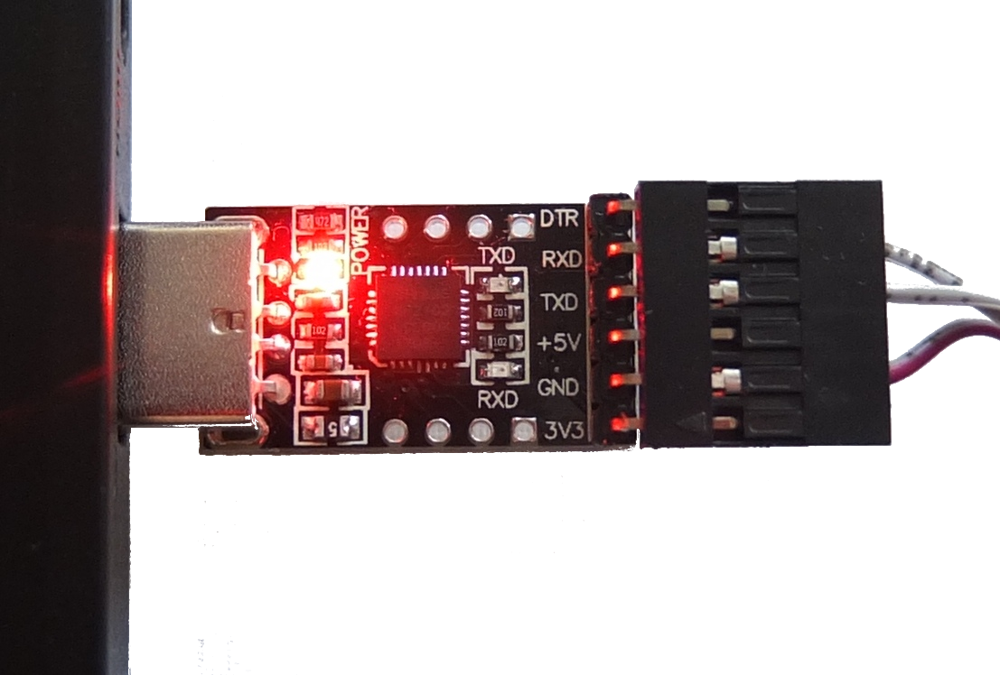

# Connecting to the TRIK controller using UART


This article is automatically translated from Russian by Google Translator.


In addition to connecting the TRIK controller to the computer using [Wi-Fi](wi-fi/), it can be connected via a USB to UART interface converter based on the chip CP2102:

The connection algorithm is described below.

1. Installing drivers
2. Setting up the COM port
3. Modem installation
4. Modem setup
5. Creating a network connection
6. Setting up a network connection
7. Connecting to the controller

## 1. Installing drivers 

1\. [Download](https://www.silabs.com/documents/public/software/CP210x\_Windows\_Drivers.zip) the drivers from the converter manufacturer's official website: [silabs.com](https://www.silabs.com).\
2\. Unpack the archive and run the driver installer corresponding to your operating system (32 or 64 bit).

3\. After the installation is complete, connect the USB to the UART converter to the computer (without the controller). Wait until the device is detected.

4\. Check in the "Device Manager" if the driver has been installed correctly.

5\. If the `CP2102 USB to UART Bridge Controller` shows an exclamation mark in Device Manager, as in the example below, then the device driver is not installed. Repeat the installation procedure, or contact a technician.

If the device is not on the Device Manager list, check if the USB port is working and if the device is correctly inserted into the USB port. If the device is connected correctly, the red "POWER" LED on the device should light up.

## 2. Setting up the COM port 

1\. In the "Device Manager" call the properties of `Silicon Labs CP210x USB to UART Bridge (COMx)`.&#x20;

On the "Port Settings" tab, set:

* Bits per second: 115200.
* Flow Control: No.

With the "Advanced" button you can select the number of the COM port, if necessary:

## 3. Modem installation 

Open Windows Control Panel any way



&#x20;




&#x20;




&#x20;




&#x20;




1\. From the Control Panel, select the Phone & Modem section.

2\. Enter any phone code for the city and press "OK".

3\. On the "Modems" tab, click the "Add" button.

4\. Select "Do not detect my modem, I will select it from list" and click "Next".

.png>)

5\. Select "Standard Modem Types" → "Communications cable between two computers" and click "Next".

6\. Select the previously specified port (COM3 in our example), then click "Next" and "Done".

## 4. Modem setup 

1\. Once again, from the Control Panel, select Phone & Modem and click the Modems tab.\
2\. Select "Communications cable between two computers (COM3)" and click "Properties".

3\. Press "Change settings" button on General tab, elsewere, the necessary settings will not be available

4\. The "Modem" tab should correctly display the COM port (COM3).&#x20;

* Set Port Speed: 115200

.png>)

5\. On "Advanced" tab press "Change Default Preferences..." button

6\. On "General" tab, set:

* Port Speed: 115200.
* Flow Control: None.

Then click OK - OK.

## 5. Creating a network connection 

Open Parameters("All Settings")&#x20;
→ "Network & Internet" → "Dial-Up" → "Set up a new connection". &#x20;

\
or Control Panel → "Network and Sharing Center" → "Set up a new connection on network"

Select "Connect to the Internet - Set up a broadband or dial-up connection to the Internet" and click "Next".

Setup connection anyway

Select "Dial-up"

4\. Enter `1` in the "Number to Dial" field, fill the connection name, and click "Connect".

Leave the username and password fields blank

.png>)

5\. Wait for some time, then select "Set up the connection anyway".

6\. Click Close.

## 6. Setting up a network connection

1\.  Open "Network Connections" (Control Panel → "Network and Sharing Center → "Change adapter settings" or Parameters ("All Settings")&#x20;
→ "Network & Internet" →  "Change adapter options").

2\. Go to the properties of the created connection.

3\. On the General tab, select "Communications cable between two computers (COMx)" and click "Configure".

4\. Select the following option:

* Select max. speed: 115200
* Uncheck the "Hardware flow control" box.&#x20;
* Click OK.

5\. On the "Options" tab, check boxes according to the picture below and click the "PPP Settings..." button.

6\. Uncheck "Enable software compression" and click "OK".

7\. On the "Network" tab, the "IPv4" protocol must be enabled. IPv4 options&#x20;
→ Automatic (by default)

&#x20;

## 7. Connecting to the controller

1\. Remove the USB to the UART converter from the USB connector.\
2\. Turn on the controller.\
3\. Connect the USB to the UART converter to the appropriate port on the controller.

3\. Connect the USB to UART converter to the computer.

4\. Open Parameters ("All Settings")&#x20;
→ "Network & Internet" →  "Dial-up". Click on the connection and click the "Connect" button.

5\. Click "Dial"

6\. If everything is done correctly, the "RXD" and "TXD" lights on the inverter should flash.

.png>)

And the connection status should change to active.

7\. Open the Phone Connection Status window.

8\. Click the Details button.

9\. The IPv4 address must be `10.0.5.1` .

10\. If this is correct, you can access the [web interface](web-interface.md) at `10.0.5.2`.

11\. Or specify the IP address `10.0.5.2` in the corresponding TRIK Studio window to control the controller.

