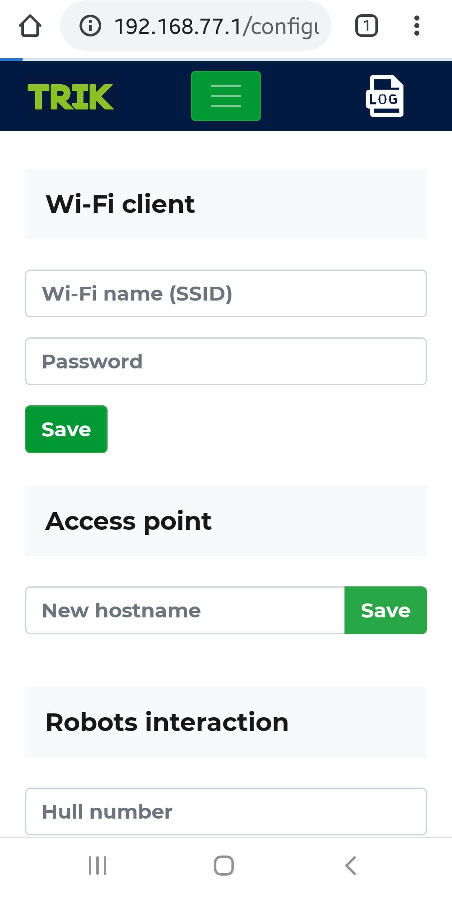

# Connecting the TRIK controller to a computer and smartphone

The TRIK controller can be connected to other devices in two ways:

1. Using the TRIK controller as an access point (the controller creates a new network) and connects the devices to it.
2. Using the TRIK controller in Wi-Fi client mode and connect the devices and the controller itself to an existing network.

## Method 1. The controller in the Wi-Fi access point mode 

In this mode, the controller creates a new network, so we can connect devices to it.

1\. Select `Network → Wi-Fi hotspot` in the menu. The controller will distribute Wi-Fi, and the network parameters will appear on the screen:

* Network name.
* Password.
* Controllers IP address.

2\. When connecting a computer or smartphone to a Wi-Fi network, select the network and enter the password.

## Method 2. The controller in the Wi-Fi client mode 

In this mode, we connect the controller and devices to an existing Wi-Fi network.

To do this, in the controller's [web interface](../web-interface.md), we need to enter the name and password of the network to which we will connect the controller.

1\. To launch the web interface, connect your computer or smartphone to the controller as an access point.

2\. In the address bar of the browser, enter the IP address of the controller. The web interface will open.











3\. In the "Wi-Fi client" field, enter the name and password of the network to which you want to connect the controller. Click the Save button.

4\. Switch the controller to Wi-Fi client mode.

5\. If the connection is successful, the controller's IP address will be displayed at the top of the screen next to the icon , and the network name will be highlighted in the list with the icon .

