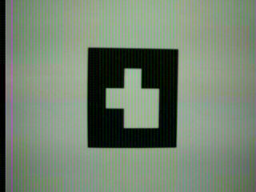

# Capturing images with TRIK camera and using them in TRIK Studio


This article is automatically translated from Russian by Google Translator.



**Warning!** This functionality is in test mode. To use it you need to install a [test version](https://dl.trikset.com/distro/testing/trik-image-core-trikboard-20200219175703.rootfs.img.xz) of the firmware. We will be glad to get your feedback and suggestions about this functionality. Write to [support](https://trikset.com/en/support#feedback) with a note "Test of working with images in TRIK Studio".


Developing the algorithm under unchanged conditions allows to debug and test it faster, as well as to evaluate and compare the quality of the algorithm and its modifications. This is especially important for computer vision algorithms, when any, even small, camera movement significantly changes the shooting conditions and, as a result, the captured image.

This article will describe how to capture images on the TRIK controller camera, upload this data to a computer and use it in TRIK Studio to develop and debug computer vision algorithms.


**ARTag 5x5 datasets**

ARTag marker recognition programs can be improved and tested in TRIK Studio on the [dataset](https://dl.trikset.com/trikset-help/ARTags.zip) (see step 3). It includes photos of ARTag 5x5 markers from different angles on a standard TRIK controller camera. The name of each folder in the dataset is the number that is encoded on the ARTag markers that lie in that folder.


## **Shooting images on the TRIK controller**


**Warning!** Connect the camera to the "video2" port before turning on the controller.



1\. From the controller menu, select`Testing → Camera`.


2\. The image taken by the camera will be displayed on the screen. It will be saved to the internal memory of the controller.&#x20;



To take more photos, press the "Exit" (cross) button on the controller and select the `Camera` menu item again.


Uploading images via the TRIK web interface


1\. Connect the TRIK controller to the computer.


[network-connection.md](../wi-fi/network-connection.md)


2\. Enter the IP address of the controller in the address bar of your browser. The TRIK web interface opens.


[web-interface.md](../web-interface.md)


3\. Go to the "Images" tab and click "Download all" to download the image archive.



4\. Go to the folder with the downloaded archive and unzip it. Now you can select the images that are best suited for developing and testing the current algorithm.

Using images in TRIK Studio


1\. Open the Robot settings in TRIK Studio.


[faq-robot-settings.md](../../studio/interface/faq-robot-settings.md)


2\. In the window that opens, select `Robot Model → 2D Model` and type in the path to the previously loaded images.



3\. Now when you call **getPhoto**, the images from the specified folder will be loaded sequentially.


[function-getphoto.md](../programming-code/function-getphoto.md)





Don't forget to use the functions for drawing graphical primitives ([drawRect](../programming-code/object-brick/class-display.md#drawrect), [drawLine](../programming-code/object-brick/class-display.md#drawline), [drawPoint](../programming-code/object-brick/class-display.md#drawpoint), etc.) and the [show](../programming-code/object-brick/class-display.md#show) function to speed up the process of developing and debugging image processing algorithms.



Example program



An example of a program that sequentially displays images loaded from a specified folder with a 2-second delay.



1\. [Download](https://drive.google.com/open?id=1B-OcmMpYiCu5iMWoJRawnvL54F-MhHp7) the file to your computer or create a new project and copy the code:

```javascript
var main = function()
{   
    var msCount = 2000;
    for (var i = 0; i< 5; i++) { // Display 5 images sequentially on the controller screen   	 
   	 brick.display().show(getPhoto(), 160, 120, "rgb32");
   	 brick.display().redraw();
   	 script.wait(msCount);   	 
    } 
	return;
}
```

2\. Run the code in debug mode, using the 2D model as the program execution mode. The controller will display images sequentially on the display.


