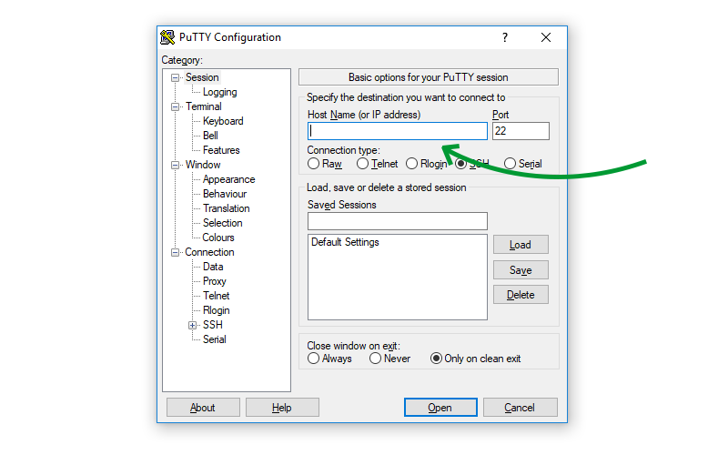
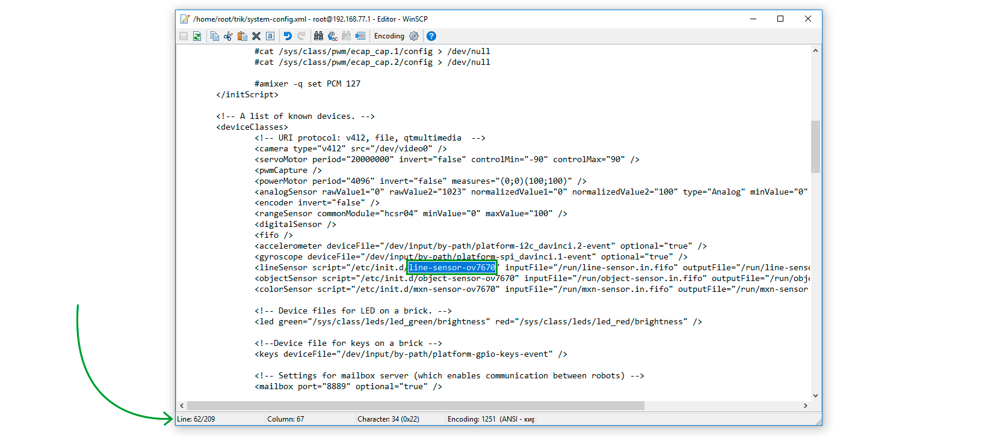

# Configuring the operation of a USB camera with a TRIK controller


This article is automatically translated from Russian by Google Translator.



The following describes how to set up the USB camera in `lineSensor` mode.


To work with the USB camera, you must change the path to the script in the `system-config.xml` file on the TRIK controller.

This can be done with either of the two utilities:

1. [PuTTY](usb-camera.md#putty).
2. [WinSCP](usb-camera.md#winscp).

## **PuTTy**

1\. [Connect](../wi-fi/network-connection.md) to the controller using "Wi-Fi Access Point" or "Wi-Fi Client" mode.

2\. Open [TRIK Studio](https://trikset.com/products/trik-studio).

3\. Launch the PuTTY utility. To do this, from the main menu, open `Tools → External tools → PuTTY`.&#x20;


4\. Enter the [IP address of the controller ](../wi-fi/network-connection.md)(specified in the network parameters of the controller) and click "Open".



5\. In the window that appears, enter `root`. Leave the "Password" field blank.


6\. Enter the command `cd trik` to navigate to the corresponding directory


7\. Use the **vi** editor to edit the file. To run it, type `vi system-config.xml`.


8\. Use the arrow keys on your keyboard to move to line 62.


```markup
Resolution: 240x320 depth 16
Converting image from 16
Now writing PNG file (compression -1)
```

9\. Press `i` to edit, find the script name `line-sensor-ov7670` and correct it to `line-sensor-webcam`.&#x20;


10\. To exit edit mode, press "Esc".

11\. Enter the command `:wq` and press "Enter" to save and exit the **vi** editor.

## **WinSCP**

1\. In the directory with the installed TRIK Studio, go to the `winscp` folder and run **WinSCP.exe**.

2\. Fill in the data:

* **File protocol:** SCP.
* **Host name —** [IP address of the controller](../wi-fi/network-connection.md).
* **User name:** root.

Leave the "Password" field blank.


3\. Press the "Login" button.

4\. If the "Warning" window appears, click "Yes".&#x20;


5\. Navigate to the `trik` folder.


6\. Find and open the `system-config.xml` file.


7\. On line 62 of the file that opens, find the name of the script `line-sensor-ov7670` and correct it to `line-sensor-webcam`.&#x20;



8\. Save your changes by pressing `Ctrl+S` or the "floppy" icon in the upper left corner, and close the editor.


