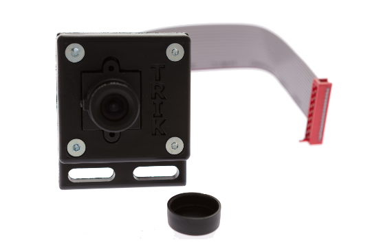
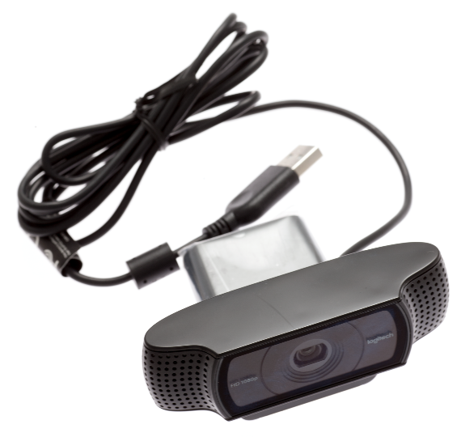

# Connecting and working with the video module


This article is automatically translated from Russian by Google Translator.


Both video modules and USB webcams can be connected to the TRIK controller.

|                                  Video module                                  |                                 USB webcam                                |
| :----------------------------------------------------------------------------: | :-----------------------------------------------------------------------: |
|   |   |

## Connecting

The video module connects to the **video1** or **video2** port, the USB webcam connects to the **USB port**.&#x20;

Connect the video module to the **video2** (or **video1**) port so that the red plug pin is on the right.\
&#x20;&#x20;

## Using

The camera in TRIK Studio can be run in three modes:

1. As a line sensor.
2. As objects sensor.
3. As a color sensor.

Write an algorithm to initialize the video camera:

After the camera is initialized, a video broadcast with additional graphic elements will appear on the display.&#x20;


**Warning!** By default, the **Line Sensor mode** will be enabled. To change the mode of use, go to the properties of the "Initialize Camera" block and change the mode to the desired one.


## LineSensor

The camera as a line sensor is needed to solve the problem of driving on the line, as well as on a discontinuous line.

In order to enable the camera as a line sensor, you must change the camera mode in the "Initialize Camera" block properties, to Line Sensor. The Line Sensor mode has a [lineSensor](../programming-visual/sensory-variables.md#linesensor) variable.

#### Example

**Task.** Write an algorithm for moving the robot along a line using a camera.

#### Algorithm writing

1\. Initialize the variable `k` - the proportionality factor to be used in the proportional regulator for the robot's motion.

2\. Initialize the camera as a line sensor.


**Warning!** The "Wait for button to be pressed" block is necessary so that the camera has time to turn on. When the image from the camera appears on the robot's screen, you can proceed to the next step.


3\. Detect the camera on the object.

4\. Write a controller for motion. Use the "Line Sensor to Variable" block, which writes a reading of the object's deviation from the center of the screen along the X-axis (from -100 to 100) to a variable specified in the properties. In other words, it is a dynamic error.

#### General view of the algorithm

#### Running the algorithm on a real robot

1\. Run the program on the robot.

2\. Wait for the camera to turn on.

3\. In **Line Sensor mode**, the screen will display 4 purple guides. Aim the camera at the line so that the right edge of the line falls in the corridor between the two right guides and the left edge between the two left guides.

4\. Press the `Up` button on the controller to detect an object (line).

Note that the video is streamed to the screen in 240×140 px format, which is exactly half of the screen.

The line must fill with yellow dots, as in the picture, to know that detection has occurred:

5\. Press the `Down` button.

## ObjectSensor

The camera as an object sensor is required for object recognition and tracking tasks. In order to enable the camera as a line sensor, you must change the camera mode, in the properties of the "Initialize Camera" block, to `Object Sensor`. The `Object Sensor` mode has sensor variables: [objectSensorSize, objectSensorX, objectSensorY](../programming-visual/sensory-variables.md).

#### Example

**Task.** Write an algorithm for object recognition using a camera.


**Attention!** The robot must output to the console the coordinates of the object center and its diameter in pixels.


#### Algorithm writing

1\. Initialize the camera as an object sensor.


**Warning!** The "Wait for the button to be pressed" block is necessary so that the camera has time to turn on. When the camera image appears on the robot's screen, you can proceed to the next step.


2\. Detect the camera on the object.

3\. Write a loop with a condition to exit the program by pressing Esc on a false branch.

4\. On the true branch, add a function to assign the coordinates of the center of the object and the diameter in pixels, to the variables `a`, `b`, `c`.

5\. Next, add the variables `a`, `b`, `c` to the console and end the loop with the "Timer" block:

#### General view of the algorithm

#### Running the algorithm on a real robot

1\. Run the program on the robot.

2\. Wait for the video camera to turn on.

3\. Position the robot so that the camera is facing a small square on the object. Press the `Up` button on the controller to detect the object.

To understand that detection has occurred, the object must fill with yellow dots, as in the picture:

&#x20;4\. Press the `Down` button on the controller.

## ColorSensor

The camera as a color sensor is necessary for color recognition tasks.

In order to enable the camera as a line sensor, you must change the camera mode, in the properties of the "Initialize Camera" block to `Color Sensor`.

`Color Sensor` mode has sensor variables of three colors (red, green, blue): [colorSensorR, colorSensorG, colorSensorB](../programming-visual/sensory-variables.md#colorsensor).

In Color Sensor mode, the camera divides the frame into 9 zones and returns the average color value of the center zone.

#### Example

Write an algorithm for recognizing green and red using a camera. The robot should output to the console the color it sees.


Note that the problem can only be solved on a real robot.


#### Algorithm writing

1\. Initialize the camera as a color sensor.


**Warning!** The "Wait for button to be pressed" block is necessary so that the camera has time to turn on. When the camera image appears on the robot's screen, you can proceed to the next step.


2\. Add the function of assigning touch variables to variables `a`, `b`.

3\. Write a condition that will distinguish between red and green. Given that red is `colorSensorR = 255` , and green is `colorSensorG = 255` .

#### Algorithm

#### Running the algorithm on a real robot

1\. Execute the program on the robot.\
2\. Wait for the video camera to turn on.\
3\. Position the robot so that the camera is pointing at the color you want to recognize.

4\. Press the `Up` button on the controller to start color recognition. The robot should display the color the camera is pointing at (Green, Red).\
